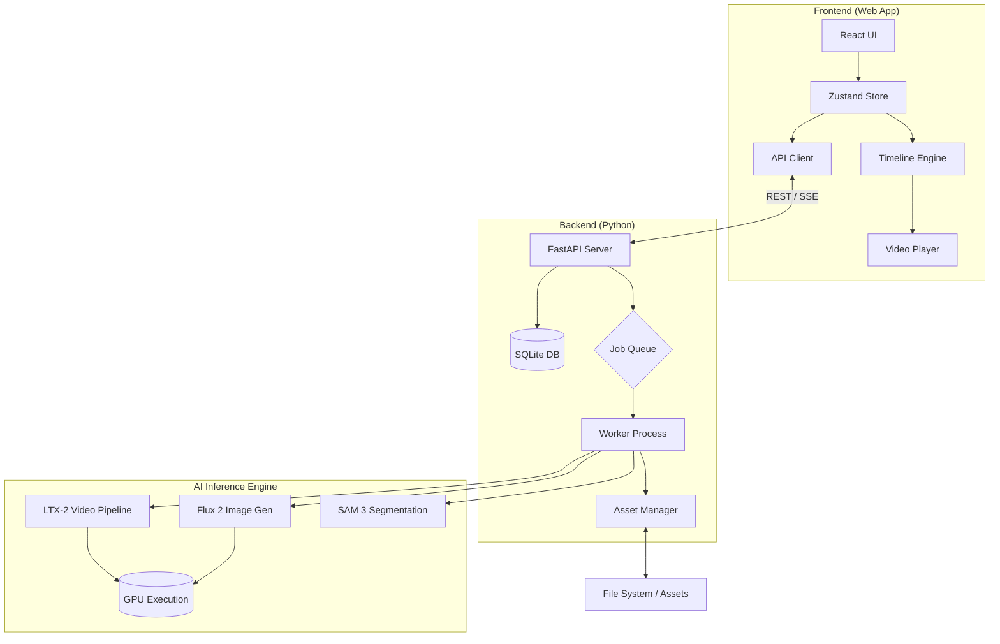

# Milimo Video - System Architecture

## 1. System Overview

Milimo Video is a local-first, AI-native cinematic studio. It follows a split architecture:
- **Frontend**: React/Vite/TypeScript application handling UI, Timeline State, and Preview.
- **Backend**: Python/FastAPI server handling Model Inference, Asset Management, and Job Queues.
- **AI Engine**: LTX-2 (Video), Flux 2 (Image), SAM 3 (Masking) running in dedicated environments.

## 2. Architecture Diagram

## 3. Core Component Interactions

| Interaction | Protocol | Description |
|---|---|---|
| **UI to Backend** | HTTP REST | Creating projects, submitting generation jobs, updating assets. |
| **Backend to UI** | Server-Sent Events (SSE) | Real-time progress updates (tqdm), job completion status, error logs. |
| **Worker to Models** | Direct Import / RPC | The worker loads models into VRAM and executes inference steps. |
| **Timeline to Player** | Browser DOM | The playback engine manages `video` elements based on timeline state. |

## 4. Key Subsystems

### A. The Timeline Engine (Frontend)
The heart of the NLE. It does NOT use a canvas. It uses absolute positioning (CSS) for performance.
- **Store**: `timelineStore.ts` (Zustand) is the single source of truth.
- **Visuals**: `VisualTimeline.tsx` renders tracks and clips.
- **Playback**: `PlaybackEngine.tsx` synchronizes the `currentTime` to the `requestAnimationFrame` loop.

### B. The Generation Pipeline (Backend)
Handles the heavy lifting.
- **Task Dispatch**: `tasks/video.py` creates a job and initializes the pipeline.
- **Latent Handoffs**: `ti2vid_two_stages.py` supports passing `LatentState` between generations for chaining.
- **Conditioning**: `ic_lora.py` injects image/video signals (ControlNet-like) into the diffusion process.
