# Milimo Video — System Architecture

## 1. System Overview

Milimo Video is a local-first, AI-native cinematic studio with a split architecture:

- **Frontend**: React 18 / Vite / TypeScript — UI, Timeline State, Multi-Track NLE, Preview Player
- **Backend**: Python / FastAPI — Model Inference, Asset Management, Job Queue, Database
- **AI Models**: LTX-2 (Video), Flux 2 (Image/Inpainting), SAM 3 (Segmentation)
- **LLM**: Configurable prompt enhancement — Gemma (built-in) or Ollama (local)
- **Memory**: Central `MemoryManager` enforces mutual exclusion between GPU models
- **Microservice**: SAM 3 runs as a separate FastAPI server on port 8001

## 2. High-Level Architecture Diagram

```mermaid
graph TD
    subgraph "Frontend — React / Vite / TypeScript"
        App[App.tsx] --> Layout[Layout.tsx]
        Layout --> Player[CinematicPlayer]
        Layout --> VT[VisualTimeline]
        Layout --> Inspector[InspectorPanel]
        Layout --> Library[MediaLibrary]
        Layout --> Elements[ElementsView]
        Layout --> LLMSet[LLMSettings]
        Layout --> Storyboard[StoryboardView]
        Layout --> Images[ImagesView]
        Layout --> PM[ProjectManager]
        
        Player --> PBE[PlaybackEngine]
        PBE --> GAM[GlobalAudioManager]
        PBE --> TU[timelineUtils]
        
        VT --> TTrack[TimelineTrack]
        TTrack --> TClip[TimelineClip]
        TTrack --> AClip[AudioClip]
        VT --> Playhead[Playhead]
        VT --> Snap[snapEngine]

        Inspector --> Cond[ConditioningEditor]
        Inspector --> AdvSettings[AdvancedSettings]
        Inspector --> ShotParams[ShotParameters]
        Inspector --> NarDir[NarrativeDirector]

        All["All Components"] --> Store[useTimelineStore]
        SSEProv[SSEProvider] --> Store
        SSEProv --> SSE_Client[SSE EventSource]
        Store --> JobPoll[jobPoller]
    end

    subgraph "Backend — Python / FastAPI (port 8000)"
        SSE_Client <-->|"SSE / REST"| API[FastAPI Server]
        JobPoll -->|"REST GET"| API
        API --> Router[APIRouter]
        
        Router --> R_Proj[routes/projects.py]
        Router --> R_Jobs[routes/jobs.py]
        Router --> R_Assets[routes/assets.py]
        Router --> R_Elem[routes/elements.py]
        Router --> R_Story[routes/storyboard.py]
        
        R_Jobs --> Tasks
        R_Story --> Tasks
        
        API --> DB[(SQLite via SQLModel)]
        API --> EvMgr[EventManager — SSE]
    end

    subgraph "Task Engine"
        Tasks[tasks/] --> VideoTask[video.py]
        Tasks --> ChainedTask[chained.py]
        Tasks --> ImageTask[image.py]
        
        VideoTask --> LLM_Dispatch[llm.py — LLM Dispatcher]
        VideoTask --> ME[ModelManager]
        VideoTask -->|"num_frames==1"| FluxW[FluxInpainter]
        ChainedTask --> ME
        ChainedTask --> LLM_Dispatch
        ChainedTask --> SBMgr[StoryboardManager]
        ImageTask --> FluxW
        ImageTask --> LLM_Dispatch
        
        R_Elem --> ElMgr[ElementManager]
        ElMgr --> FluxW
        R_Elem --> InpMgr[InpaintingManager]
        InpMgr --> FluxW
        InpMgr -->|"HTTP POST"| SAM_Svc
        
        R_Story --> ElemMatch[ElementMatcher]
        ElemMatch --> DB
    end

    subgraph "Memory Management"
        MemMgr[MemoryManager] -->|"prepare_for('video')"| ME
        MemMgr -->|"prepare_for('image')"| FluxW
        LLM_Dispatch -->|"provider=ollama"| Ollama_API[Ollama API :11434]
        LLM_Dispatch -->|"provider=gemma"| Gemma_TE[Gemma 3 Text Encoder]
    end

    subgraph "AI Inference"
        ME --> LTX_TI2V[TI2VidTwoStagesPipeline]
        ME --> LTX_IC[ICLoraPipeline]
        ME --> LTX_KF[KeyframeInterpolationPipeline]
        
        FluxW --> Flux2_Model[Flux 2 Klein 9B]
        FluxW --> IP_Adapter[IP-Adapter — CLIP ViT-L]
        FluxW --> AE_Native[Native AutoEncoder]
        FluxW --> AE_Diffusers[Diffusers AE Fallback]
        
        LTX_TI2V --> GPU[(GPU / MPS)]
        LTX_IC --> GPU
        LTX_KF --> GPU
        Flux2_Model --> GPU
    end

    subgraph "SAM 3 Microservice (port 8001)"
        SAM_Svc[FastAPI Server] --> SAM_Model[SAM 3 Model]
        SAM_Svc --> SAM_Health["/health"]
        SAM_Svc --> SAM_Predict["/predict/mask"]
        SAM_Svc --> SAM_Detect["/detect"]
        SAM_Svc --> SAM_SegText["/segment/text"]
        SAM_Svc --> SAM_Track["/track/*"]
    end

    API -->|"Range-Aware Media Serving"| FS[File System]
```

## 3. Core Component Interactions

| Interaction | Protocol | Description |
|---|---|---|
| **UI → Backend** | HTTP REST | CRUD for projects, shots, elements, assets. Job dispatch. |
| **Backend → UI** | SSE (Server-Sent Events) | Real-time progress updates, job completion, error logs. |
| **UI Refresh Sync** | HTTP GET `/status/{job_id}` | One-shot job state recovery on page load via `jobPoller`. |
| **Worker → LTX-2** | Direct Python Import | `ModelManager` loads LTX-2 pipelines into VRAM. One pipeline cached at a time. `MemoryManager.prepare_for("video")` unloads Flux first. |
| **Worker → Flux 2** | Direct Python Import | `FluxInpainter` singleton for image gen + inpainting. `MemoryManager.prepare_for("image")` unloads LTX first. |
| **Prompt Enhancement** | Configurable via `llm.py` | `enhance_prompt()` routes to Gemma (built-in) or Ollama (HTTP API). Ollama sends `keep_alive: 0` to unload after use. |
| **Backend → SAM** | HTTP REST (port 8001) | Segmentation (point, text, box), multi-object detection, and video tracking via SAM 3 microservice. |
| **Timeline → Player** | Headless rAF subscription | `PlaybackEngine` drives `currentTime` via `requestAnimationFrame` with cached layout. `CinematicPlayer` subscribes with throttled drift correction (250ms). |
| **Playback → Audio** | `GlobalAudioManager` singleton | Web Audio API (`AudioContext` + `AudioBufferSourceNode`) for precise cross-browser playback. Buffers decoded upfront; drift tolerance 0.3s. |
| **Static Media Serving** | HTTP Range Requests | `server.py` serves `.mp4`/`.mp3`/audio files with `206 Partial Content` and `Accept-Ranges: bytes` for Safari compatibility. |
| **Flux AE Hot-Swap** | Internal | `FluxInpainter` toggles between native AE (supports reference conditioning) and diffusers AE (fallback) based on `enable_ae` flag. |

## 4. Key Subsystems

### A. The Timeline Engine (Frontend)
CSS-based NLE — no canvas rendering. Uses absolute positioning for performance.

| Component | Role |
|---|---|
| `timelineStore.ts` | Single Zustand store (7 slices) — source of truth |
| `VisualTimeline.tsx` | Renders tracks, clips, playhead. Handles drag-and-drop. |
| `TimelineTrack.tsx` | Renders a single track with clips. |
| `TimelineClip.tsx` | Individual clip with drag/resize handles. Uses `translateX` for GPU compositing. |
| `AudioClip.tsx` | Specialized clip for audio tracks with waveform-like display. |
| `PlaybackEngine.tsx` | Headless rAF loop driving `currentTime` and audio sync. |
| `timelineUtils.ts` | `computeTimelineLayout()` — centralized layout with magnetic V1 logic. |
| `snapEngine.ts` | Snap-to-grid/clip/playhead during drag operations. |

### B. The Generation Pipeline (Backend)
Handles video, image, chained, and inpainting generation.

| Component | Role |
|---|---|
| `model_engine.py` | `ModelManager` singleton — loads/manages LTX-2 pipelines. Auto-selects checkpoint (full > FP8). |
| `tasks/video.py` | `generate_video_task()` — orchestrates pipeline selection, prompt enhancement, path resolution, delegates to standard or chained gen. Single-frame requests shortcut to Flux 2. |
| `tasks/chained.py` | `generate_chained_video_task()` — autoregressive multi-chunk generation with Quantum Alignment latent handoff and ffmpeg overlap trimming. |
| `tasks/image.py` | `generate_image_task()` — Flux 2 image generation with element/trigger resolution, IP-Adapter reference images, Asset DB record creation. |
| `models/flux_wrapper.py` | `FluxInpainter` singleton — wraps Flux 2 Klein 9B with AE hot-swap, MPS hacks, IP-Adapter, True CFG double-pass, and RePaint inpainting. |
| `storyboard/manager.py` | `StoryboardManager` — dual-mode (worker/server). Chunk preparation, last-frame extraction via ffmpeg, shot-based prompt enrichment with narrative context. |
| `services/ai_storyboard.py` | `ai_parse_script()` — Gemma 3 AI script analysis. Parses free-form text into structured scenes/shots via chat interface with cinematic system prompt. Falls back to regex parser if Gemma unavailable. |
| `services/element_matcher.py` | `ElementMatcher` — Intelligent production matching engine. Uses 8 signals (exact name, trigger word, scene heading, action keywords, etc.) to link script elements to project assets. |

### C. The API Layer (Backend)
5 routers with ~30 endpoints.

| Router | Prefix | Key Endpoints |
|---|---|---|
| `projects.py` | `/projects` | CRUD, save, render, split shot, get images |
| `jobs.py` | `/status`, `/generate` | Status polling, advanced generation, image generation, cancel |
| `assets.py` | `/uploads`, `/assets` | File upload, list media, delete, get last frame |
| `elements.py` | `/elements`, `/edit`, `/track` | Element CRUD, visualize, inpaint, segment, tracking save/load |
| `storyboard.py` | `/storyboard` | Parse script (regex + AI), commit, get hierarchy, update scene, generate shot, batch generate, generate thumbnails, reorder scenes/shots, add/delete shots |

### D. The Player System (Frontend)
"Program Monitor" pattern with multi-component composition.

| Component | Role |
|---|---|
| `CinematicPlayer.tsx` | Container with `VideoSurface`, `PlayerHUD`, `LoadingOverlay`, `ControlsBar` |
| `VideoSurface` | `memo`'d + `forwardRef` `<video>` element. Starts muted for Safari autoplay policy, auto-unmutes on first user gesture. Drift correction throttled to 250ms intervals with `fastSeek()` support. |
| `PlaybackEngine.tsx` | Headless rAF loop driving `currentTime`. Caches `computeTimelineLayout` in a `useRef` (only recomputes when `project.shots` changes) to eliminate per-frame GC pressure. |
| `GlobalAudioManager.ts` | Web Audio API singleton — uses `AudioContext` with `AudioBufferSourceNode` for precise, Safari-compatible audio playback. Buffers decoded upfront via `fetch()` + `decodeAudioData()`. Context resumed lazily on first user gesture. |
| `AudioClip.tsx` | Waveform display via WaveSurfer. Detects Safari at runtime and uses `MediaElement` backend for better compatibility; defaults to `WebAudio` backend on Chrome/other browsers. |
| `PlayerHUD` | Resolution/FPS/Seed overlay |
| `LoadingOverlay` | Generation progress display with ambient glow effects |
| `ControlsBar` | Play/pause, edit mode toggle, tracking mode toggle (Crosshair icon), fullscreen |
| `TrackingPanel.tsx` | Video object tracking UI — session lifecycle (start/prompt/propagate/stop), text/click prompts, mask overlay canvas, frame navigation, export/save masks. Mutually exclusive with edit mode. |

### G. The SSE System (Frontend)
Reliable server-sent events with auto-reconnect.

| Component | Role |
|---|---|
| `SSEProvider.tsx` | React context provider — manages `EventSource` lifecycle with exponential backoff reconnect. Syncs in-flight jobs on mount via `jobPoller`. Listens for `progress`, `complete`, `error`, `log` events. |
| `useEventSource.ts` | Standalone hook for SSE connections (low-level). Returns `{lastEvent, isConnected}`. |
| `useSSE()` | Context hook — provides `{isConnected, lastEventTime}` from `SSEProvider`. |

### E. The Inspector System (Frontend)
Shot editing panel with sub-components.

| Component | Role |
|---|---|
| `InspectorPanel.tsx` | Master panel — shows selected shot details, generate/cancel/extend |
| `LLMSettings.tsx` | AI settings — provider selection (Gemma/Ollama), model dropdown with 👁️ vision badges, keep_alive toggle |
| `ShotParameters.tsx` | Resolution, frames, FPS, seed controls |
| `AdvancedSettings.tsx` | CFG scale, pipeline override, enhance prompt toggle, enable AE, True CFG |
| `ConditioningEditor.tsx` | Image/video conditioning management with drag-drop |
| `NarrativeDirector.tsx` | Action/dialogue/character metadata for storyboard |

### F. The SAM 3 Microservice
Isolated segmentation and tracking service.

| Component | Role |
|---|---|
| `sam3/start_sam_server.py` | FastAPI server (port 8001). Loads SAM 3 at startup with `build_sam3_image_model` + `Sam3Processor`. Video predictor lazy-loaded with MPS/CUDA/CPU device auto-detection. |
| `GET /health` | Returns `{status, model_loaded, processor_ready}` for readiness probes |
| `POST /predict/mask` | Point/box segmentation → binary PNG mask |
| `POST /detect` | Text-prompted multi-object detection → JSON (masks, bboxes, scores) |
| `POST /segment/text` | Text → merged binary mask PNG (for inpainting) |
| `POST /track/*` | Video tracking: `start`, `prompt`, `propagate`, `stop` |
| `InpaintingManager` | Backend HTTP client — point masks, text masks, object detection |
| `TrackingManager` | Backend HTTP client — session-based video tracking |
| `POST /track/remove` | Remove prompt from tracking session |
| `POST /edit/track/save` | Export tracking masks + metadata to disk |
| `POST /edit/track/load` | Reload saved tracking data from disk |
