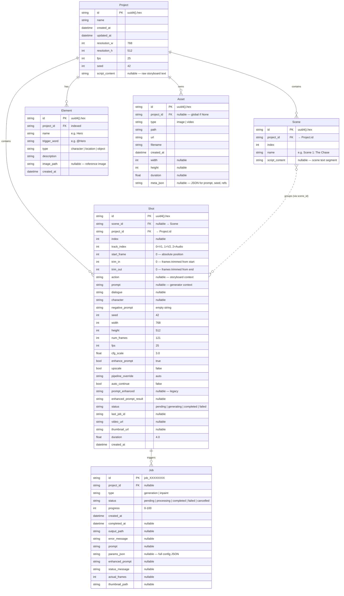
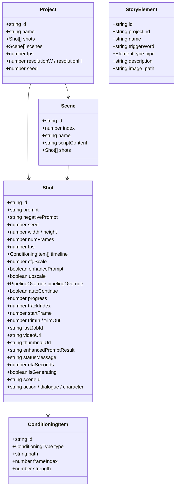

# Milimo Video — Data Models

## 1. Entity-Relationship Diagram



## 2. Pydantic Request Schemas (`schemas.py`)

```mermaid
classDiagram
    class TimelineItem {
        +str path
        +int frame_index = 0
        +float strength = 1.0
        +Literal["image","video"] type
    }

    class ShotConfig {
        +str id
        +str prompt
        +str negative_prompt = ""
        +int seed = 42
        +int width = 768
        +int height = 512
        +int num_frames = 121
        +int fps = 25
        +int num_inference_steps = 40
        +float cfg_scale = 2.0
        +bool enhance_prompt = True
        +bool upscale = True
        +str pipeline_override = "auto"
        +bool auto_continue = False
        +str scene_id
        +str action
        +str dialogue
        +str character
        +List~TimelineItem~ timeline = []
    }

    class GenerateAdvancedRequest {
        +str project_id
        +ShotConfig shot_config
    }

    class GenerateImageRequest {
        +str project_id
        +str prompt
        +str negative_prompt = ""
        +int width = 1024
        +int height = 1024
        +int num_inference_steps = 25
        +float guidance_scale = 2.0
        +int seed
        +List~str~ reference_images = []
        +bool enable_ae = True
        +bool enable_true_cfg = False
    }

    class ProjectState {
        +str id
        +str name
        +List~dict~ shots
        +List~dict~ scenes = []
        +int resolution_w = 768
        +int resolution_h = 512
        +int fps = 25
        +int seed = 42
    }

    class CreateProjectRequest {
        +str name
        +int resolution_w = 768
        +int resolution_h = 512
        +int fps = 25
        +int seed = 42
    }

    class ElementCreate {
        +str name
        +str type
        +str description
        +str trigger_word
        +str image_path
    }

    class ElementVisualizeRequest {
        +str prompt_override
        +float guidance_scale = 2.0
        +bool enable_ae = True
    }

    class InpaintRequest {
        +str image_path
        +str mask_path
        +str text_mask
        +str points
        +str prompt
    }

    class ScriptParseRequest {
        +str script_text
        +str parse_mode = "auto"
    }

    class StoryboardShotData {
        +str action
        +str dialogue
        +str character
        +str shot_type
    }

    class StoryboardSceneData {
        +str name = "Scene 1"
        +str content
        +List~StoryboardShotData~ shots
    }

    class CommitStoryboardRequest {
        +List~StoryboardSceneData~ scenes
    }

    class ReorderShotsRequest {
        +str scene_id
        +List~str~ shot_ids
    }

    class AddShotRequest {
        +str scene_id
        +str action = "A cinematic shot..."
        +str dialogue
        +str character
        +str shot_type = "medium"
    }

    class BatchGenerateRequest {
        +List~str~ shot_ids
    }

    class UpdateSceneRequest {
        +str name
    }

    class BatchThumbnailRequest {
        +List~str~ shot_ids
        +int width = 512
        +int height = 320
        +bool force = False
    }

    CommitStoryboardRequest --> StoryboardSceneData
    StoryboardSceneData --> StoryboardShotData
    GenerateAdvancedRequest --> ShotConfig
    ShotConfig --> TimelineItem
```



### Schema → Backend Mapping

| Schema | Endpoint | Task Function | AI Model |
|---|---|---|---|
| `GenerateAdvancedRequest` | `POST /generate_advanced` | `generate_video_task()` → delegates to standard or chained | LTX-2 (or Flux 2 if `num_frames==1`) |
| `GenerateImageRequest` | `POST /generate_image` | `generate_image_task()` | Flux 2 Klein 9B via `FluxInpainter` |
| `ElementVisualizeRequest` | `POST /elements/{id}/visualize` | `generate_visual_task()` | Flux 2 Klein 9B via `FluxInpainter` |
| `InpaintRequest` | `POST /edit/inpaint` | `process_inpaint()` | SAM 3 (mask via point/text) → Flux 2 (RePaint). Creates `Job` DB record for status polling. |
| `ScriptParseRequest` | `POST /projects/{id}/script/parse` | `script_parser.parse_script()` | None (regex) |
| `ScriptParseRequest` | `POST /projects/{id}/storyboard/ai-parse` | `ai_parse_script()` | Gemma 3 (via LTX-2 text encoder) |
| `CommitStoryboardRequest` | `POST /projects/{id}/storyboard/commit` | Smart merge (direct DB) | None |
| `BatchThumbnailRequest` | `POST /projects/{id}/storyboard/thumbnails` | `generate_image_task()` | Flux 2 (`is_thumbnail=True`) |
| `BatchGenerateRequest` | `POST /projects/{id}/storyboard/batch-generate` | `generate_video_task()` | LTX-2 |

### Key Default Values

| Parameter | Video (ShotConfig) | Image (GenerateImageRequest) | Notes |
|---|---|---|---|
| Resolution | 768×512 | 1024×1024 | Video is landscape, images are square |
| Inference Steps | 40 | 25 | Video needs more steps for temporal coherence |
| CFG Scale | 2.0 | 2.0 | Guidance strength |
| Seed | 42 | dynamic | Image seed can vary |
| Enable AE | n/a | `True` | Controls native vs diffusers AE in FluxInpainter |
| True CFG | n/a | `False` | Enables double-pass negative prompting (2× inference time) |

## 3. Frontend TypeScript Types (`types.ts`)



### Type Enums
| Enum | Values | Used By |
|---|---|---|
| `PipelineOverride` | `"auto" \| "ti2vid" \| "ic_lora" \| "keyframe"` | `ShotConfig.pipeline_override` |
| `ConditioningType` | `"image" \| "video"` | `ConditioningItem.type` |
| `ElementType` | `"character" \| "location" \| "object"` | `StoryElement.type` |
| `ViewMode` | `"timeline" \| "elements" \| "storyboard" \| "images"` | `UISlice.viewMode` |

## 4. Database Schema (SQLite via SQLModel)

| Table | Primary Key | Relationships | Description |
|---|---|---|---|
| `project` | `id` (UUID hex) | → shots, scenes | Global settings (resolution, FPS, seed) |
| `scene` | `id` (UUID hex) | → project (FK) | Storyboard scenes with script content |
| `shot` | `id` (UUID hex) | → project (FK) | Atomic unit: generation spec + timeline clip |
| `element` | `id` (UUID hex) | indexed by project_id | Story elements (characters/locations/objects) with trigger words for IP-Adapter |
| `asset` | `id` (UUID hex) | nullable project_id | Uploaded/generated media files. `meta_json` stores generation params (prompt, seed, guidance, reference elements). |
| `job` | `id` (string) | nullable project_id | Async task tracking with progress and results. Status transitions: `pending → processing → completed/failed/cancelled`. |

### Connection Configuration
```python
engine = create_engine(
    DATABASE_URL,
    connect_args={"check_same_thread": False},  # Required for FastAPI
    pool_size=20,
    max_overflow=40  # Prevents QueuePool limit errors during heavy polling
)
```

### Zombie Job Recovery
On server startup, the lifespan handler queries for jobs with `status="processing"` and marks them as `"failed"`. This prevents stale lock-up from crashed workers.

## 5. Data Storage Layout

```
backend/
├── projects/
│   └── {project_id}/
│       ├── generated/          # Output videos (.mp4) and images (.jpg)
│       ├── thumbnails/         # Video/image thumbnails (.jpg)
│       ├── workspace/          # Temp workspace for chained gen
│       │   └── storyboard_artifacts/  # Last-frame PNGs for chaining (ffmpeg -sseof)
│       ├── assets/
│       │   └── elements/       # Element reference images (IP-Adapter targets)
│       └── inpaint_{job_id}.jpg  # Inpainting outputs (redirected from assets/ to generated/)
├── uploads/                    # Legacy global uploads
├── generated/                  # Legacy global outputs
├── models/
│   ├── flux2/                  # Flux 2 Klein 9B weights
│   │   ├── flux-2-klein-9b.safetensors
│   │   ├── ae.safetensors      # Native AutoEncoder (preferred)
│   │   ├── vae/                # Diffusers AE fallback
│   │   ├── text_encoder/       # Qwen 3 (8B)
│   │   ├── tokenizer/          # Qwen Tokenizer
│   │   └── ip-adapter.safetensors
│   └── sam3/                   # SAM 3 checkpoint directory
│       └── sam3.pt             # SAM 3 model weights (~3.4GB)
└── milimovideo.db             # SQLite database
```
