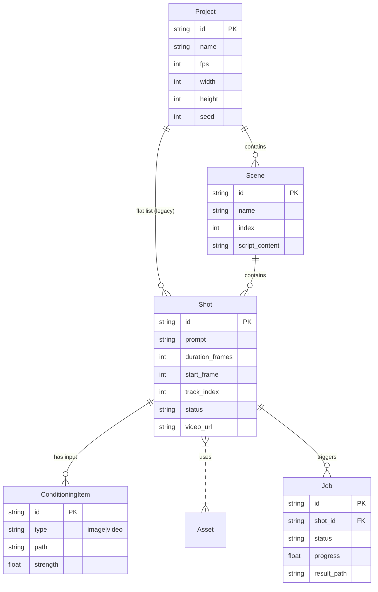

# Milimo Video - Data Models

## 1. Entity-Relationship Diagram

## 2. Core Structures

### Project
The root container.
- **Structure**: Defined in `database.py` (SQL) and `types.ts` (Frontend).
- **Storage**: `projects/{id}/project.json` + SQLite metadata.

### Shot
The atomic unit of generation AND editing.
- **Dual Nature**:
    1.  **Generation Spec**: Contains `prompt`, `seed`, `cfg`, `model_params`.
    2.  **Timeline Clip**: Contains `trackIndex`, `startFrame`, `trimIn`, `trimOut`.
- **Properties**:
    - `timeline`: Array of `ConditioningItem` (images/videos used as inputs).
    - `main_asset`: The resulting video file.

### Asset (Story Element)
Persistent visual identities.
- **Types**: Character, Location, Object.
- **Usage**: Stored in `ElementSlice`. Used to inject consistent visual conditioning into shots via `triggerWord`.

## 3. Database Schema (SQLite)

The backend uses SQLModel (SQLAlchemy).

| Table | Primary Key | Description |
|---|---|---|
| `Project` | `id` (UUID) | Global project settings. |
| `Job` | `id` (UUID) | Async task tracking. Linked to shots. |
| `Shot` | `id` (UUID) | *[Planned]* Moving full shot state to DB (currently hybrid JSON/DB). |
