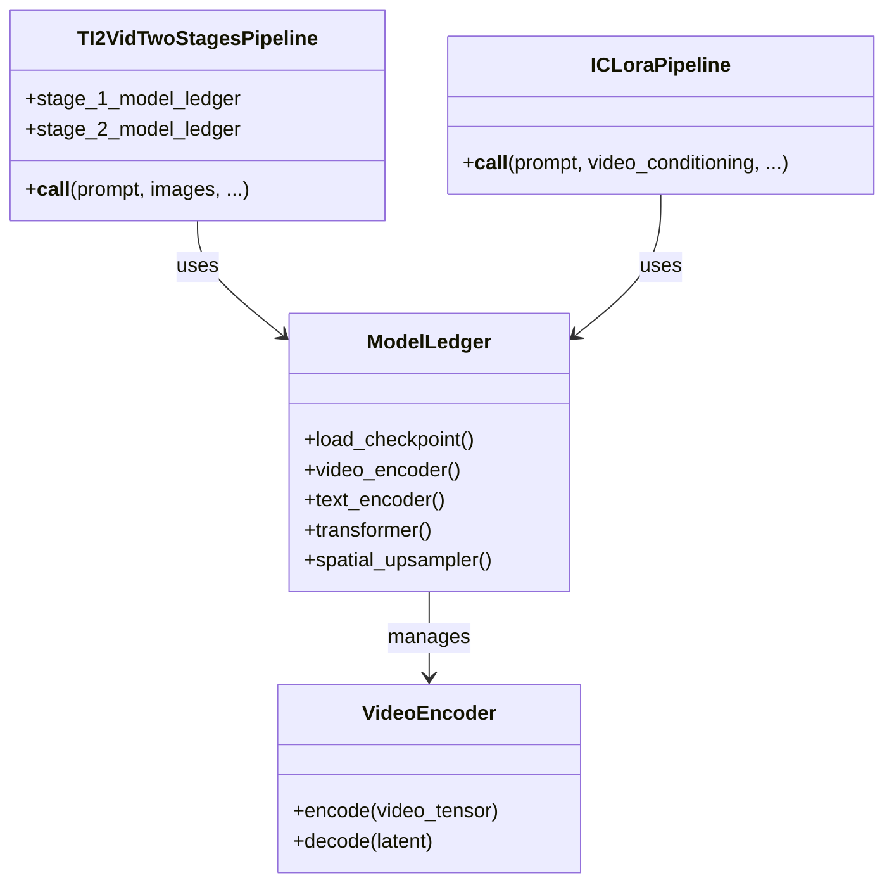

# Milimo Video - LTX-2 Pipeline Analysis

## 1. Pipeline Architecture

The `LTX-2` integration is built on a modular `ModelLedger` system that manages weights and VRAM.

## 2. Two-Stage Generation Process

The `TI2VidTwoStagesPipeline` (`ti2vid_two_stages.py`) implements a high-quality generation flow:

### Stage 1: Base Generation
- **Input**: Text Prompt + Optional Image Conditioning.
- **Resolution**: `Height / 2`, `Width / 2`.
- **Model**: Base Transformer with LoRAs.
- **Output**: Low-res Latent.

### Stage 2: Spatial Upsampling
- **Input**: Stage 1 Latent.
- **Process**:
    1.  **VAE Upsample**: Latent is upscaled spatially.
    2.  **Denoising**: Refined using a "Distilled" LoRA for texture details.
- **Output**: High-res Latent.

### Stage 3: Temporal Upsampling (Optional)
- **Status**: Implemented but experimental in pipeline.
- **Input**: Stage 2 Latent.
- **Output**: 2x Frame count.

## 3. Conditioning Mechanism

Milimo uses a custom `image_conditionings_by_replacing_latent` approach:
- Input images are encoded into latents.
- These latents **replace** the noisy latents at specific spatial/temporal positions (usually frame 0).
- This acts as a "hard" constraint for the diffusion start point.

## 4. Latent Handoffs (Chaining)

To support logical shot chaining (Shot A -> Shot B):
1.  The pipeline accepts `previous_latent_tensor`.
2.  In **Stage 1**, this tensor is downsampled and injected as conditioning.
3.  In **Stage 2**, it is used directly.
4.  This ensures Shot B starts exactly where Shot A ended, maintaining visual continuity.
