# Milimo Video — AI Pipeline Analysis

## 1. Pipeline Architecture Overview


## 2. LTX-2 Video Generation

### 2.1 Pipeline Selection Logic

The `generate_video_task()` function in `tasks/video.py` determines which pipeline to load:

| Condition | Pipeline | Use Case |
|---|---|---|
| `num_frames == 1` | **Flux 2** (bypass LTX) | Single frame → delegates to `FluxInpainter.generate_image()` |
| `pipeline_override == "auto"` + 2 images at different frames | `keyframe` | Keyframe interpolation between start/end frames |
| `pipeline_override == "auto"` + IC-LoRA elements | `ic_lora` | Subject consistency via IC-LoRA concept injection |
| `pipeline_override == "auto"` (default) | `ti2vid` | Text/Image-to-Video (primary pipeline) |
| `ti2vid` AND `num_frames > 121` | chained task | Autoregressive continuation → `generate_chained_video_task()` |

### 2.2 Two-Stage Generation Process (`TI2VidTwoStagesPipeline`)

```mermaid
flowchart TD
    subgraph "Stage 1 — Base Generation"
        S1_IN[Text Prompt + Optional Image Conditioning] --> S1_ENC[Text Encoder — Gemma 3]
        S1_ENC --> S1_TR[Dual-Stream Transformer — 19B params]
        S1_TR --> S1_LORA[Distilled LoRA-384 applied]
        S1_LORA --> S1_LOOP
        
        subgraph S1_LOOP["Denoising Loop (8 steps distilled / 40 base)"]
            S1_STEP[Step N]
            S1_STEP --> S1_CB[Progress Callback]
            S1_CB --> S1_CANCEL{Cancellation Check}
            S1_CANCEL -->|Continue| S1_STEP
        end
        S1_LOOP --> S1_OUT["Low-Res Latent — H/2 x W/2"]
    end

    subgraph "Stage 2 — Spatial Upsampling"
        S1_OUT --> S2_UP[VAE Spatial Upsample — 2x]
        S2_UP --> S2_DN[Denoise with Distilled LoRA]
        S2_DN --> S2_OUT[High-Res Latent — Full Resolution]
    end

    subgraph "Stage 3 — Temporal Upsampling (Optional)"
        S2_OUT --> S3_UP[Temporal Upsample — 2x frames]
        S3_UP --> S3_OUT[High-Res + Frame-Doubled Latent]
    end

    S2_OUT --> DECODE[VAE Decode]
    S3_OUT -.-> DECODE
    DECODE --> ENCODE[FFmpeg Encode → MP4]
    ENCODE --> SAVE[Save to projects/id/generated/]
    SAVE --> THUMB[Generate Thumbnail via FFmpeg]
```



### 2.3 Image Conditioning Mechanism

Milimo uses `image_conditionings_by_replacing_latent`:
1. Input images are encoded to latents via the video VAE
2. These latents **replace** noisy latents at specific spatiotemporal positions (usually frame 0)
3. Acts as a "hard" constraint for the diffusion start point
4. Supports multiple conditioning items with configurable `strength` and `frame_index`

### 2.4 Chained Generation — Quantum Alignment

For videos exceeding 121 frames, `tasks/chained.py` implements autoregressive chunk-by-chunk generation:

```mermaid
flowchart TD
    START[generate_chained_video_task] --> CALC[StoryboardManager.get_total_chunks]
    CALC --> LOOP

    subgraph LOOP["Chunk Loop"]
        PREP[prepare_next_chunk] -->|"chunk 0"| GEN[Run TI2Vid — 121 frames]
        PREP -->|"chunk > 0"| EXTRACT[Extract Last Frame — ffmpeg -sseof -0.1]
        EXTRACT --> COND[Set as Image Conditioning at frame 0]
        COND --> GEN
        
        GEN --> CAPTURE[Capture Stage 1 Latent Tensor]
        CAPTURE --> ALIGN[Quantum Alignment Math]
        
        subgraph ALIGN["Latent Handoff Calculation"]
            QA1["latent_slice_count = ceil((overlap_px - 1) / 8) + 1"]
            QA2["effective_overlap_px = (latent_slice_count - 1) × 8 + 1"]
            QA3["frames_to_trim = effective_overlap_px"]
            QA4["conditioning_latent = last_latent[:,:,start_slice:,:,:]"]
            QA1 --> QA2 --> QA3 --> QA4
        end
        
        ALIGN --> TRIM[Trim overlap frames — ffmpeg -ss]
        TRIM --> COMMIT[commit_chunk]
        COMMIT --> CANCEL{Cancelled?}
        CANCEL -->|No| PREP
        CANCEL -->|Yes| ABORT[Mark Failed]
    end

    LOOP --> STITCH[FFmpeg Concat All Chunks]
    STITCH --> FINAL[Final Video Output]
```



**Chunk Parameters:**
- `chunk_size`: 121 frames (LTX-2 context window max)
- `overlap_frames`: 24 frames (requested pixel overlap)
- `effective_step`: 97 frames per chunk (121 - 24)

**Quantum Alignment Math** (latent grid = 8 pixels/latent):
| Parameter | Formula | Example (24 px overlap) |
|---|---|---|
| `latent_slice_count` | `ceil((24-1)/8) + 1` | = 4 latents |
| `effective_overlap_px` | `(4-1) × 8 + 1` | = 25 pixels |
| `frames_to_trim` | = `effective_overlap_px` | = 25 frames |

**Why "Quantum"**: The latent grid quantizes continuous pixel space into 8-pixel steps. Overlap must be aligned to this grid to avoid discontinuities. Misaligned overlaps cause "frozen anchor" artifacts where the overlap region appears static.

### 2.5 MPS Compatibility (LTX-2)

| Issue | Fix | Location |
|---|---|---|
| FP8 unsupported on MPS | `fp8transformer=False` on MPS | `model_engine.py` line 103 |
| VAE decode → black frames | `pipeline.vae.to(dtype=torch.float32)` | `model_engine.py` line 144 |
| `bfloat16` → dtype mismatch | Pipeline loader casts all weights to float32/float16 | LTX pipeline constructors |
| Memory fragmentation | `gc.collect()` + `torch.mps.empty_cache()` on pipeline swap | `model_engine.py` line 80 |

## 3. Flux 2 Image Generation

### 3.1 FluxInpainter Architecture


### 3.2 Sequential "True" CFG

Flux 2 natively uses **Guided Distillation** (single scalar guidance vector) and ignores negative prompts. Milimo re-enables standard negative prompting via a custom double-pass loop in `denoise_inpaint()`:

1. **Pass 1 (Unconditional)**: Model forward with empty/negative text embeddings. IP-Adapter tokens **stripped**.
2. **Pass 2 (Conditional)**: Model forward with positive text + IP-Adapter tokens.
3. **CFG Blend**: `pred = pred_uncond + cfg_scale × (pred_cond - pred_uncond)`

| `enable_true_cfg` | `cfg_scale` | Negative Prompt | Performance Impact |
|---|---|---|---|
| `False` (default) | `1.0` (disabled) | **Ignored** | No overhead |
| `True` | `2.0` (fixed safe) | Active | 2× inference time |

### 3.3 Reference Image Conditioning (Native AE)

`get_reference_embeds()` encodes reference images into the Flux 2 temporal embedding space:

1. Load PIL images from paths (max 3 refs on MPS, capped at 768² pixels).
2. Center-crop to multiple of 16, normalize to `[-1, 1]`.
3. Encode through `ae.encode()` → latent tokens.
4. Assign temporal offsets: `t_off = scale + scale × t` (scale=10) to separate refs from target.
5. During denoising: `model_input = cat(x, img_cond_seq)` — ref tokens concatenated.

### 3.4 IP-Adapter Integration

| Component | Details |
|---|---|
| **Vision Encoder** | `openai/clip-vit-large-patch14` (CLIPVisionModelWithProjection) |
| **Projector** | `ImageProjModel`: `Linear(1024, 4×4096)` → reshape → `LayerNorm(4096)` |
| **Output** | 4 Flux-hidden-state tokens per reference image |
| **Weights** | `config.FLUX_IP_ADAPTER_PATH` (safetensors) |
| **Injection** | Tokens concatenated to input sequence during denoise loop |

### 3.5 In-Painting (RePaint Method)

Used by `InpaintingManager.process_inpaint()`:

1. Resize image/mask to multiple of 16.
2. Encode image → latents (`x_orig`) via `ae.encode()`.
3. Flatten mask → downscale to latent-size `(H/16, W/16)` → reshape to `(1, L, 1)`.
4. Initialize `x` with pure noise.
5. Each denoising step:
   - Predict update direction.
   - **RePaint blend**: `x_pred = mask × x_pred + (1 - mask) × x_known`
   - Where `x_known = t_prev × noise + (1 - t_prev) × x_orig`
6. Decode result via `ae.decode()` (CPU offload on MPS).
7. Result saved to `projects/{id}/generated/inpaint_{job_id}.jpg`.

### 3.6 MPS Compatibility (Flux 2)

| Issue | Fix | Location |
|---|---|---|
| VAE decode → black images | CPU + float32 for decode only | `FluxAEWrapper.decode()` |
| Transformer NaNs with bf16 | Force `float32` for entire flow model | `FluxInpainter.__init__` |
| Memory fragmentation | `gc.collect()` + `torch.mps.empty_cache()` before denoise | `generate_image()` |
| Reference image OOM | Cap to 3 refs, max 768² pixels on MPS | `get_reference_embeds()` |

## 4. SAM 3 Segmentation & Tracking


### SAM 3 Microservice API

| Endpoint | Method | Request | Response |
|---|---|---|---|
| `/health` | GET | — | `{"status": "running", "model_loaded": bool, "processor_ready": bool}` |
| `/predict/mask` | POST | `image` (file) + `points` (JSON) + `labels` (JSON) + `multimask` (bool) + `boxes` (JSON, optional) | Binary PNG mask, or JSON multi-mask with scores |
| `/detect` | POST | `image` (file) + `text` (str) + `confidence` (float) | JSON: `{objects: [{mask, bbox, score, label}]}` |
| `/segment/text` | POST | `image` (file) + `text` (str) + `confidence` (float) | Binary PNG mask (all objects merged) |
| `/track/start` | POST | `video_path` (str) | `{session_id, status}` |
| `/track/prompt` | POST | `session_id` + `frame_idx` + `text`/`points`/`boxes` | `{status: "prompt_added"}` |
| `/track/propagate` | POST | `session_id` + `direction` + `start_frame` + `max_frames` | `{frames: [{frame_idx, masks}]}` |
| `/track/stop` | POST | `session_id` | `{status: "closed"}` |

**Server Configuration:**
- Port: `config.SAM_SERVICE_PORT` (default 8001)
- Model: `backend/models/sam3/sam3.pt` (~3.4GB, auto-downloads from HuggingFace if missing)
- Device: auto-detected (`cuda` > `mps` > `cpu`)
- MPS Fallback: `PYTORCH_ENABLE_MPS_FALLBACK=1` (set in `run_sam.sh`) for ops not yet on MPS
- Startup: `build_sam3_image_model(checkpoint_path, device, enable_inst_interactivity=True)` + `Sam3Processor`
- Video predictor: lazy-loaded on first `/track/*` request; `device` is passed to `Sam3VideoPredictor(device=...)` for CUDA/MPS/CPU placement
- Inpaint job persistence: `POST /edit/inpaint` creates a `Job` DB record; `update_job_db()` called on completion/failure

### 4.1 MPS Compatibility (SAM 3)

| Issue | Fix | Location |
|---|---|---|
| `grid_sample` crashes with empty tensors | Early return guard when `n_points == 0` | `geometry_encoders.py:_encode_points` |
| `pin_memory()` is CUDA-only | Replaced with direct `.to(device=...)` | `geometry_encoders.py:_encode_boxes` |
| `_assert_async` not implemented on MPS | `PYTORCH_ENABLE_MPS_FALLBACK=1` env var | `run_sam.sh` |
| FLASH/EFFICIENT SDPA backends unavailable | Restrict to `MATH` backend on MPS | `vl_combiner.py:forward_text` |
| BFloat16 incompatible with numpy | `.float()` cast before `.numpy()` | `start_sam_server.py:detect_objects` |
| `Sam3VideoPredictor.__init__()` hardcodes `.cuda()` | Added `device` param; `.to(self.device)` with auto-detect (CUDA → MPS → CPU) | `sam3_video_predictor.py:__init__` |
| `_get_session_stats()` / `_get_torch_and_gpu_properties()` call `torch.cuda.*` | Guarded behind `torch.cuda.is_available()` | `sam3_video_predictor.py` |

## 5. Model Management & Memory

### Central Memory Manager (`memory_manager.py`)

On Apple Silicon with unified memory, GPU models share the same physical RAM. The `MemoryManager` enforces mutual exclusion between heavy models to prevent OOM:

```mermaid
flowchart TD
    subgraph Slots["Memory Slots"]
        VIDEO["video — LTX-2 (~76GB)"]
        IMAGE["image — Flux 2 (~36GB)"]
        LLM["llm — Ollama (variable)"]
    end

    subgraph Rules["Conflict Rules"]
        R1["video ↔ image: mutually exclusive"]
        R2["llm: managed via Ollama keep_alive API"]
    end

    PREPARE["memory_manager.prepare_for(slot)"] --> CHECK{Conflicts?}
    CHECK -->|Yes| UNLOAD["Unload conflicting slot"]
    CHECK -->|No| LOAD["Proceed to load"]
    UNLOAD --> FLUSH["gc.collect() + mps.empty_cache()"]
    FLUSH --> LOAD
```



**Slot lifecycle:**
- `model_engine.py` calls `prepare_for("video")` before loading any LTX pipeline → unloads Flux
- `flux_wrapper.py` calls `prepare_for("image")` before loading Flux → unloads LTX
- `flux_wrapper.py` `unload()` calls `release("image")` to update slot tracking

### Ollama Keep-Alive Control

`llm.py` sends `keep_alive: config.OLLAMA_KEEP_ALIVE` (default `"0"`) in every Ollama generate request. After prompt enhancement completes, an explicit unload request is sent:

```python
requests.post(url, json={"model": model, "keep_alive": 0, "prompt": "", "stream": False})
```

This frees the Ollama model (e.g., gemma3-27b at ~49GB VRAM) immediately, rather than waiting for the default 5-minute timeout. Configurable via `MILIMO_OLLAMA_KEEP_ALIVE` env var or the frontend AI Settings toggle (`LLMSettings.tsx`).

### Device Selection
```python
device = "cpu"
if torch.cuda.is_available():
    device = "cuda"
elif torch.backends.mps.is_available():
    device = "mps"
```

### Pipeline Swap Logic (ModelManager)
When switching pipeline types:
1. Delete existing pipeline reference
2. Call `gc.collect()`
3. Empty GPU cache (`torch.cuda.empty_cache()` / `torch.mps.empty_cache()`)
4. **Call `memory_manager.prepare_for("video")`** — unloads Flux if loaded
5. Load new pipeline with appropriate checkpoint
6. If MPS: force `pipeline.vae` to `float32`

### AE Hot-Swap Logic (FluxInpainter)
When `enable_ae` toggle changes between calls:
1. Full model unload (flow model, AE, text encoder, IP-Adapter)
2. `memory_manager.release("image")` called
3. Reload with new AE variant (native or diffusers)
4. Tracked via `last_ae_enable_request` memo

### Checkpoint Auto-Selection (ModelManager)
1. Priority: `ltx-2-19b-distilled.safetensors` (full precision)
2. Fallback: `ltx-2-19b-distilled-fp8.safetensors` (FP8, CUDA only)
3. Warning logged if neither found

### Model Paths (from `config.py`)
| Model | Path |
|---|---|
| LTX-2 Checkpoint | `LTX-2/models/checkpoints/ltx-2-19b-distilled.safetensors` |
| LTX-2 FP8 (fallback) | `LTX-2/models/checkpoints/ltx-2-19b-distilled-fp8.safetensors` |
| Distilled LoRA-384 | `LTX-2/models/checkpoints/ltx-2-19b-distilled-lora-384.safetensors` |
| Spatial Upsampler | `LTX-2/models/upscalers/ltx-2-spatial-upscaler-x2-1.0.safetensors` |
| Temporal Upsampler | `LTX-2/models/upscalers/ltx-2-temporal-upscaler-x2-1.0.safetensors` |
| Gemma 3 Text Encoder | `LTX-2/models/text_encoders/gemma3/` |
| Flux 2 Klein 9B | `backend/models/flux2/flux-2-klein-9b.safetensors` |
| Flux Native AE | `backend/models/flux2/ae.safetensors` |
| Flux Diffusers AE | `backend/models/flux2/vae/` |
| Flux Text Encoder | `backend/models/flux2/text_encoder/` (Qwen 3 8B) |
| Flux IP-Adapter | `backend/models/flux2/ip-adapter.safetensors` |
| SAM 3 Checkpoint | `backend/models/sam3/sam3.pt` |

## 6. Prompt Enhancement

### 6.1 LLM Dispatcher (`llm.py`)

All prompt enhancement routes through a single dispatcher module `llm.py` that selects between two providers:

| Provider | Config Value | Model | Enhancement Method |
|---|---|---|---|
| **Gemma** (built-in) | `gemma` | Gemma 3 (LTX-2 text encoder) | Direct `text_encoder._enhance()` on-device |
| **Ollama** (local) | `ollama` | Any Ollama model (e.g., gemma3-27b) | HTTP API `POST /api/generate` |

```python
# Usage (all callers use the same API):
from llm import enhance_prompt
enhanced = enhance_prompt(prompt, system_prompt="...", is_video=True, text_encoder=te)
```

**Ollama features:**
- `keep_alive: config.OLLAMA_KEEP_ALIVE` sent with every request (default `"0"` = unload immediately)
- Explicit unload request after enhancement to free VRAM before generation
- Vision model detection via `/api/tags` — models with `mllama`, `clip`, `llava` families tagged as `is_vision: true`
- Settings API: `GET/PATCH /settings/llm` + `GET /settings/llm/models`
- Frontend: model dropdown with 👁️ vision badges, "Keep Model Loaded" toggle

**System prompts:**
- `VIDEO_SYSTEM_PROMPT` — concise, action-focused descriptions for video generation
- `IMAGE_SYSTEM_PROMPT` — vivid, detailed descriptions for image generation

**Callers:**
- `tasks/video.py` — ti2vid, ic_lora, keyframe, single-frame Flux paths
- `tasks/chained.py` — chunk 0 and narrative continuation for chunks 1+
- `tasks/image.py` — standalone image generation
- `storyboard/manager.py` — chunk continuation prompts

### Element Injection

- `ElementManager.inject_elements_into_prompt()` scans for trigger words (e.g., `@Hero`) and returns the enriched prompt + list of element image paths for IP-Adapter conditioning
- **Implicit trigger detection**: In `tasks/image.py`, all project elements are scanned — if a trigger word appears in the prompt, the element's reference image is automatically added to `resolved_ip_paths`

## 7. AI Storyboard Analysis

### 7.1 Overview

**File**: `services/ai_storyboard.py`
**Model**: Gemma 3 text encoder (reused from LTX-2 pipeline via `model_engine.manager`)
**Endpoint**: `POST /projects/{id}/storyboard/ai-parse`

Uses the Gemma text encoder's **chat completion interface** (`_enhance()`) to intelligently parse free-form text into structured scenes and shots. This provides a smarter alternative to the regex-based `ScriptParser` — handling non-standard scripts, treatments, and prose descriptions.

### 7.2 Pipeline


### 7.3 System Prompt

The AI is instructed to act as a **professional storyboard artist and screenwriter**. Key directives:
- Output **valid JSON only** — no markdown explanation
- Each scene: 1–8 shots with varied shot types for cinematic interest
- Action descriptions: vivid and visual, suitable for AI video generation
- Dialogue paired with `close_up` or `medium` shots
- Character names in TITLE CASE
- Valid shot types: `close_up`, `medium`, `wide`, `establishing`, `insert`, `tracking`

### 7.4 JSON Extraction & Validation

`_extract_json()` handles Gemma output quirks:
1. Strip markdown `\`\`\`json` fences
2. Try direct `json.loads()` parse
3. Fallback: regex search for `[...]` array in response
4. Raise `ValueError` if no valid JSON found

`_validate_scenes()` sanitizes the output:
- Unknown shot types default to `"medium"`
- Missing actions get placeholder: `"A cinematic shot."`
- Dialogue/character fields coerced to `str | None`

### 7.5 Concept Art Thumbnails

**Endpoint**: `POST /projects/{id}/storyboard/thumbnails`
**Schema**: `BatchThumbnailRequest` (`shot_ids`, `width=512`, `height=320`, `force=False`)

For each shot without an existing `thumbnail_url` (or when `force=True`):
1. Creates a `Job` DB record with `is_thumbnail=True`
2. Dispatches `generate_image_task()` via `BackgroundTasks`
3. Flux 2 generates concept art at 512×320
4. `tasks/image.py` writes result to `Shot.thumbnail_url` for `is_thumbnail` jobs
5. SSE `complete` event includes `shot_id` — `ServerSlice` matches by `shot_id` (not `lastJobId`) and updates only the thumbnail

## 8. Smart Element Matching

### 8.1 Overview

**File**: `services/element_matcher.py`
**Endpoint**: `POST /projects/{id}/storyboard/match-elements`

The `ElementMatcher` service is a deterministic, multi-signal engine that links storyboard shots to project elements (characters, locations, objects) without requiring LLM inference. It runs after script parsing (AI or Regex) and before commit.

### 8.2 Matching Signals

The engine evaluates 8 distinct signals for every element-shot pair, calculating a composite confidence score.

| Signal | Confidence | Description |
|---|---|---|
| `character_field_exact` | **1.0** | Shot's `character` field exactly matches element name. |
| `trigger_word_in_action` | **0.95** | Element's `@TriggerWord` found in shot action. |
| `name_in_action` | **0.85** | Element name found in shot action text. |
| `partial_name_in_character` | **0.8** | Partial match in `character` field (e.g. "DETECTIVE" matches "Detective"). |
| `name_in_scene` | **0.6** | Element name found in scene heading (e.g. "INT. NEON CITY"). |
| `description_tokens` | **0.5** | Significant overlap between element description tokens and shot action. |
| `dialogue_mention` | **0.5** | Element name spoken in dialogue. |
| `action_keywords` | **0.4** | General keyword match (weak signal). |

### 8.3 Matching Flow


### 8.4 Integration Points

1.  **AI Parser**: `ai_storyboard.py` calls `match_elements()` immediately after Gemma generates the JSON structure.
2.  **Regex Parser**: `script_parser.py` calls `match_elements()` after regex extraction.
3.  **Manual Re-Match**: User can trigger matching on existing shots via the UI (calls `/match-elements`).
4.  **Generation**: `StoryboardManager` uses these matches to:
    *   Inject reference images (IP-Adapter) for characters/locations.
    *   Append trigger words to prompts automatically.

