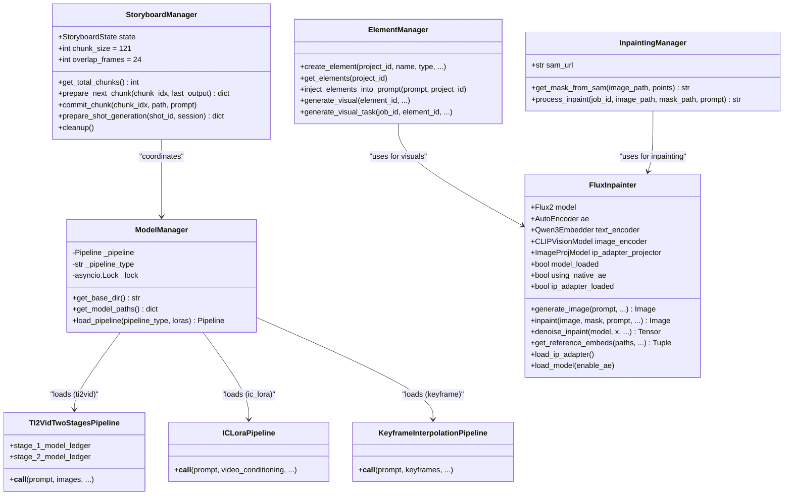
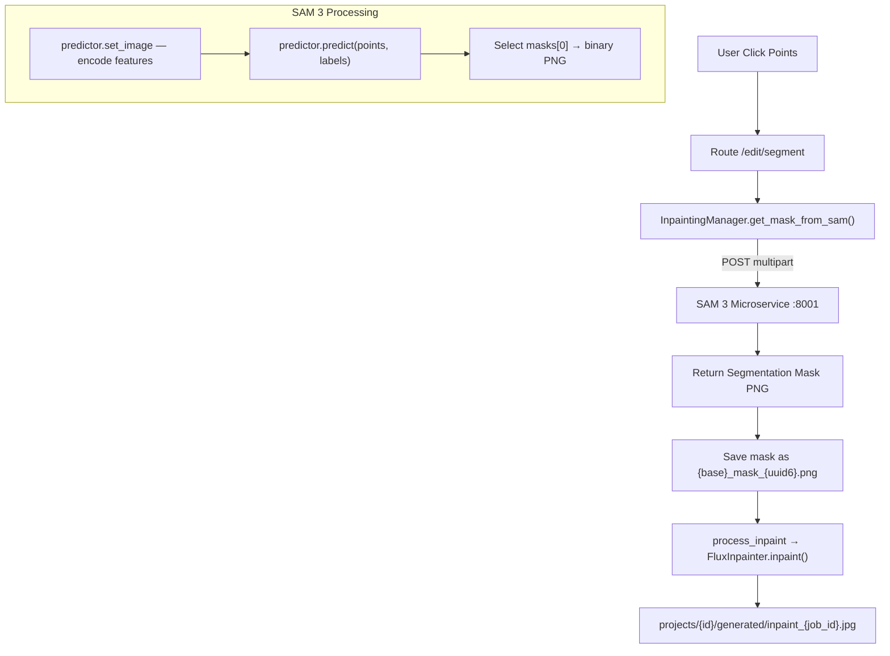

# Milimo Video — AI Pipeline Analysis

## 1. Pipeline Architecture Overview



## 2. LTX-2 Video Generation

### 2.1 Pipeline Selection Logic

The `generate_video_task()` function in `tasks/video.py` determines which pipeline to load:

| Condition | Pipeline | Use Case |
|---|---|---|
| `num_frames == 1` | **Flux 2** (bypass LTX) | Single frame → delegates to `FluxInpainter.generate_image()` |
| `pipeline_override == "auto"` + 2 images at different frames | `keyframe` | Keyframe interpolation between start/end frames |
| `pipeline_override == "auto"` + IC-LoRA elements | `ic_lora` | Subject consistency via IC-LoRA concept injection |
| `pipeline_override == "auto"` (default) | `ti2vid` | Text/Image-to-Video (primary pipeline) |
| `ti2vid` AND `num_frames > 121` | chained task | Autoregressive continuation → `generate_chained_video_task()` |

### 2.2 Two-Stage Generation Process (`TI2VidTwoStagesPipeline`)


### 2.3 Image Conditioning Mechanism

Milimo uses `image_conditionings_by_replacing_latent`:
1. Input images are encoded to latents via the video VAE
2. These latents **replace** noisy latents at specific spatiotemporal positions (usually frame 0)
3. Acts as a "hard" constraint for the diffusion start point
4. Supports multiple conditioning items with configurable `strength` and `frame_index`

### 2.4 Chained Generation — Quantum Alignment

For videos exceeding 121 frames, `tasks/chained.py` implements autoregressive chunk-by-chunk generation:


**Chunk Parameters:**
- `chunk_size`: 121 frames (LTX-2 context window max)
- `overlap_frames`: 24 frames (requested pixel overlap)
- `effective_step`: 97 frames per chunk (121 - 24)

**Quantum Alignment Math** (latent grid = 8 pixels/latent):
| Parameter | Formula | Example (24 px overlap) |
|---|---|---|
| `latent_slice_count` | `ceil((24-1)/8) + 1` | = 4 latents |
| `effective_overlap_px` | `(4-1) × 8 + 1` | = 25 pixels |
| `frames_to_trim` | = `effective_overlap_px` | = 25 frames |

**Why "Quantum"**: The latent grid quantizes continuous pixel space into 8-pixel steps. Overlap must be aligned to this grid to avoid discontinuities. Misaligned overlaps cause "frozen anchor" artifacts where the overlap region appears static.

### 2.5 MPS Compatibility (LTX-2)

| Issue | Fix | Location |
|---|---|---|
| FP8 unsupported on MPS | `fp8transformer=False` on MPS | `model_engine.py` line 103 |
| VAE decode → black frames | `pipeline.vae.to(dtype=torch.float32)` | `model_engine.py` line 144 |
| `bfloat16` → dtype mismatch | Pipeline loader casts all weights to float32/float16 | LTX pipeline constructors |
| Memory fragmentation | `gc.collect()` + `torch.mps.empty_cache()` on pipeline swap | `model_engine.py` line 80 |

## 3. Flux 2 Image Generation

### 3.1 FluxInpainter Architecture


### 3.2 Sequential "True" CFG

Flux 2 natively uses **Guided Distillation** (single scalar guidance vector) and ignores negative prompts. Milimo re-enables standard negative prompting via a custom double-pass loop in `denoise_inpaint()`:

1. **Pass 1 (Unconditional)**: Model forward with empty/negative text embeddings. IP-Adapter tokens **stripped**.
2. **Pass 2 (Conditional)**: Model forward with positive text + IP-Adapter tokens.
3. **CFG Blend**: `pred = pred_uncond + cfg_scale × (pred_cond - pred_uncond)`

| `enable_true_cfg` | `cfg_scale` | Negative Prompt | Performance Impact |
|---|---|---|---|
| `False` (default) | `1.0` (disabled) | **Ignored** | No overhead |
| `True` | `2.0` (fixed safe) | Active | 2× inference time |

### 3.3 Reference Image Conditioning (Native AE)

`get_reference_embeds()` encodes reference images into the Flux 2 temporal embedding space:

1. Load PIL images from paths (max 3 refs on MPS, capped at 768² pixels).
2. Center-crop to multiple of 16, normalize to `[-1, 1]`.
3. Encode through `ae.encode()` → latent tokens.
4. Assign temporal offsets: `t_off = scale + scale × t` (scale=10) to separate refs from target.
5. During denoising: `model_input = cat(x, img_cond_seq)` — ref tokens concatenated.

### 3.4 IP-Adapter Integration

| Component | Details |
|---|---|
| **Vision Encoder** | `openai/clip-vit-large-patch14` (CLIPVisionModelWithProjection) |
| **Projector** | `ImageProjModel`: `Linear(1024, 4×4096)` → reshape → `LayerNorm(4096)` |
| **Output** | 4 Flux-hidden-state tokens per reference image |
| **Weights** | `config.FLUX_IP_ADAPTER_PATH` (safetensors) |
| **Injection** | Tokens concatenated to input sequence during denoise loop |

### 3.5 In-Painting (RePaint Method)

Used by `InpaintingManager.process_inpaint()`:

1. Resize image/mask to multiple of 16.
2. Encode image → latents (`x_orig`) via `ae.encode()`.
3. Flatten mask → downscale to latent-size `(H/16, W/16)` → reshape to `(1, L, 1)`.
4. Initialize `x` with pure noise.
5. Each denoising step:
   - Predict update direction.
   - **RePaint blend**: `x_pred = mask × x_pred + (1 - mask) × x_known`
   - Where `x_known = t_prev × noise + (1 - t_prev) × x_orig`
6. Decode result via `ae.decode()` (CPU offload on MPS).
7. Result saved to `projects/{id}/generated/inpaint_{job_id}.jpg`.

### 3.6 MPS Compatibility (Flux 2)

| Issue | Fix | Location |
|---|---|---|
| VAE decode → black images | CPU + float32 for decode only | `FluxAEWrapper.decode()` |
| Transformer NaNs with bf16 | Force `float32` for entire flow model | `FluxInpainter.__init__` |
| Memory fragmentation | `gc.collect()` + `torch.mps.empty_cache()` before denoise | `generate_image()` |
| Reference image OOM | Cap to 3 refs, max 768² pixels on MPS | `get_reference_embeds()` |

## 4. SAM 3 Segmentation



### SAM 3 Microservice API

| Endpoint | Method | Request | Response |
|---|---|---|---|
| `/health` | GET | — | `{"status": "running", "model_loaded": bool}` |
| `/predict/mask` | POST | `image` (file) + `points` (JSON) + `labels` (JSON) + `multimask` (bool) | Binary PNG (StreamingResponse) |

**Server Configuration:**
- Port: `config.SAM_SERVICE_PORT` (default 8001)
- Model: `backend/models/sam3.pt`
- Device: auto-detected (`cuda` > `mps` > `cpu`)
- Startup: `build_sam3_image_model(checkpoint_path, device, enable_inst_interactivity=True)`

## 5. Model Management & Memory

### Device Selection
```python
device = "cpu"
if torch.cuda.is_available():
    device = "cuda"
elif torch.backends.mps.is_available():
    device = "mps"
```

### Pipeline Swap Logic (ModelManager)
When switching pipeline types:
1. Delete existing pipeline reference
2. Call `gc.collect()`
3. Empty GPU cache (`torch.cuda.empty_cache()` / `torch.mps.empty_cache()`)
4. Load new pipeline with appropriate checkpoint
5. If MPS: force `pipeline.vae` to `float32`

### AE Hot-Swap Logic (FluxInpainter)
When `enable_ae` toggle changes between calls:
1. Full model unload (flow model, AE, text encoder)
2. Reload with new AE variant (native or diffusers)
3. Tracked via `last_ae_enable_request` memo

### Checkpoint Auto-Selection (ModelManager)
1. Priority: `ltx-2-19b-distilled.safetensors` (full precision)
2. Fallback: `ltx-2-19b-distilled-fp8.safetensors` (FP8, CUDA only)
3. Warning logged if neither found

### Model Paths (from `config.py`)
| Model | Path |
|---|---|
| LTX-2 Checkpoint | `LTX-2/models/checkpoints/ltx-2-19b-distilled.safetensors` |
| LTX-2 FP8 (fallback) | `LTX-2/models/checkpoints/ltx-2-19b-distilled-fp8.safetensors` |
| Distilled LoRA-384 | `LTX-2/models/checkpoints/ltx-2-19b-distilled-lora-384.safetensors` |
| Spatial Upsampler | `LTX-2/models/upscalers/ltx-2-spatial-upscaler-x2-1.0.safetensors` |
| Temporal Upsampler | `LTX-2/models/upscalers/ltx-2-temporal-upscaler-x2-1.0.safetensors` |
| Gemma 3 Text Encoder | `LTX-2/models/text_encoders/gemma3/` |
| Flux 2 Klein 9B | `backend/models/flux2/flux-2-klein-9b.safetensors` |
| Flux Native AE | `backend/models/flux2/ae.safetensors` |
| Flux Diffusers AE | `backend/models/flux2/vae/` |
| Flux Text Encoder | `backend/models/flux2/text_encoder/` (Qwen 3 8B) |
| Flux IP-Adapter | `backend/models/flux2/ip-adapter.safetensors` |
| SAM 3 Checkpoint | `backend/models/sam3.pt` |

## 6. Prompt Enhancement

Located in `ltx_pipelines/utils/helpers.py` and `tasks/video.py`:

- `generate_enhanced_prompt(prompt, text_encoder, image_for_gemma)` — uses Gemma 3 text encoder for cinematic prompt enrichment
- **Image-conditioned enhancement**: When `image_for_gemma` is provided, the prompt is enriched with visual context from the conditioning image
- **Element injection**: `ElementManager.inject_elements_into_prompt()` scans for trigger words (e.g., `@Hero`) and returns the enriched prompt + list of element image paths for IP-Adapter conditioning
- **Implicit trigger detection**: In `tasks/image.py`, all project elements are scanned — if a trigger word appears in the prompt, the element's reference image is automatically added to `resolved_ip_paths`
