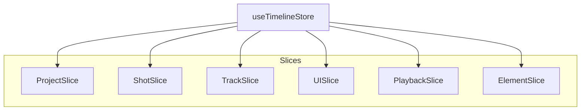

# Milimo Video - Frontend State (Zustand)

## 1. Store Structure

The `timelineStore` is a "God Store" built from multiple slices to manage complexity.



## 2. Slice Responsibilities

| Slice | Internal State | Actions |
|---|---|---|
| **ProjectSlice** | `project` (Metadata, FPS) | `loadProject`, `saveProject` |
| **ShotSlice** | logic for `shots` | `addShot`, `updateShot`, `splitShot`, `moveShot` |
| **TrackSlice** | `trackStates` (Mute/Lock) | `toggleTrackMute`, `toggleTrackLock` |
| **PlaybackSlice** | `currentTime`, `isPlaying` | `setIsPlaying`, `setCurrentTime` |
| **UISlice** | `selectedShotId`, `toasts` | `selectShot`, `addToast` |
| **ElementSlice** | `elements` (Characters/Locs) | `createElement`, `generateVisual` |

## 3. Optimisation Strategy

To prevent React render thrashing (especially during 60fps playback):

1.  **Transient State**: `currentTime` is updated via `requestAnimationFrame`. Elements subscribing to it must use **Selectors**.
    ```typescript
    // BAD
    const { currentTime } = useTimelineStore(); 
    
    // GOOD
    const currentTime = useTimelineStore(state => state.currentTime);
    ```
    
2.  **Transient Duration**: Dragging a clip updates `transientDuration` instead of the full `project` structure, avoiding deep re-renders of the entire timeline.
3.  **Shallow Comparison**: `useShallow` is used in `TimelineTrack` to only re-render when relevant track state changes.
