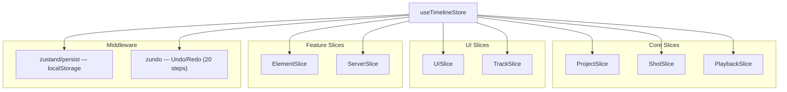
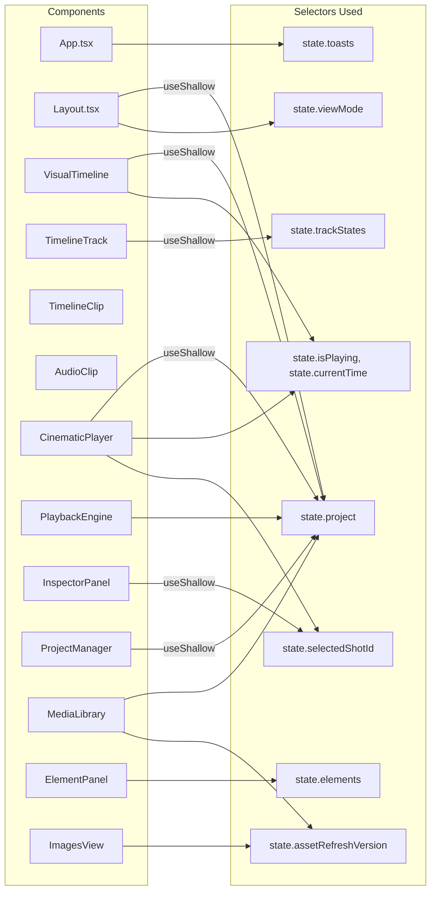
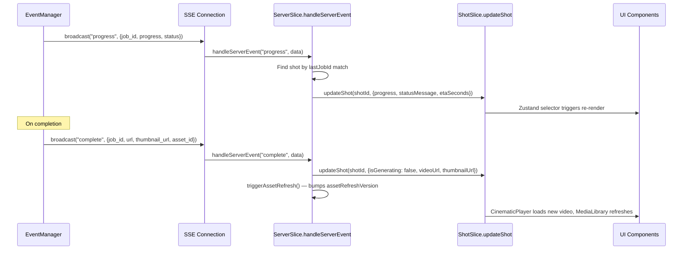

# Milimo Video — Frontend State (Zustand)

## 1. Store Architecture

The `useTimelineStore` is composed from **7 slices**, wrapped with `persist` (localStorage) and `temporal` (undo/redo via `zundo`).



## 2. Slice Responsibilities

### ProjectSlice
| State | Actions |
|---|---|
| `project: Project` | `setProject(p)` |
| `assetRefreshVersion: number` | `triggerAssetRefresh()` |
| — | `saveProject()` |
| — | `createNewProject(name, settings?)` |
| — | `loadProject(id)` |
| — | `deleteProject(id)` |

### ShotSlice
| Actions | Description |
|---|---|
| `addShot(config?)` | Add new shot with defaults |
| `updateShot(id, updates)` | Local state update |
| `patchShot(id, updates)` | Persist to backend via PATCH |
| `splitShot(id, splitFrame)` | Split at frame position |
| `reorderShots(from, to)` | Reorder in V1 track |
| `deleteShot(id)` | Remove shot |
| `moveShotToValues(id, trackIndex, startFrame)` | Move shot to track/position |
| `addConditioningToShot(shotId, item)` | Add conditioning item (image/video) |
| `updateConditioning(shotId, itemId, updates)` | Update conditioning |
| `removeConditioning(shotId, itemId)` | Remove conditioning |
| `getShotStartTime(shotId)` | Compute absolute start time |
| `generateShot(shotId)` | Dispatch generation request → POST `/generate_advanced` |
| `inpaintShot(shotId, frame, mask, prompt)` | Dispatch inpainting → POST `/edit/inpaint` |

### PlaybackSlice
| State | Actions |
|---|---|
| `currentTime: number` | `setCurrentTime(t)` |
| `isPlaying: boolean` | `setIsPlaying(p)` |

### UISlice
| State | Actions |
|---|---|
| `selectedShotId: string \| null` | `selectShot(id)` |
| `toasts: Toast[]` | `addToast(msg, type)`, `removeToast(id)` |
| `transientDuration: number \| null` | `setTransientDuration(d)` |
| `viewMode: ViewMode` | `setViewMode(mode)` |
| `isEditing: boolean` | `setEditing(e)` |

**ViewMode**: `'timeline' | 'elements' | 'storyboard' | 'images'`

### TrackSlice
| State | Actions |
|---|---|
| `trackStates: Record<number, TrackState>` | `toggleTrackMute(idx)` |
| — | `toggleTrackLock(idx)` |
| — | `toggleTrackHidden(idx)` |

**TrackState**: `{ muted: boolean; locked: boolean; hidden: boolean }`  
**Track mapping**: `0=V1 (Main)`, `1=V2 (Overlay)`, `2=A1 (Audio)`

### ElementSlice
| State | Actions |
|---|---|
| `elements: StoryElement[]` | `fetchElements(projectId)` |
| `generatingElementIds: Record<string, string>` | `createElement(projectId, data)` |
| — | `deleteElement(elementId)` |
| — | `generateVisual(elementId, ...)` → POST `/elements/{id}/visualize` |
| — | `cancelElementGeneration(elementId)` |
| — | `parseScript(text)` → `ParsedScene[]` |
| — | `commitStoryboard(scenes)` |

### ServerSlice
| Actions | Description |
|---|---|
| `handleServerEvent(type, data)` | Processes SSE events and updates relevant shot state |

**SSE Event Types Handled:**
| Event Type | Action |
|---|---|
| `progress` | Update shot `progress`, `statusMessage`, `etaSeconds`, `enhancedPromptResult` |
| `complete` | Set shot `isGenerating=false`, `videoUrl`, `thumbnailUrl`, `progress=100`; trigger `assetRefresh` |
| `error` | Set shot `isGenerating=false`, show toast |
| `cancelled` | Set shot `isGenerating=false`, `status="pending"` |

## 3. Component → Store Mapping



## 4. Middleware Configuration

### Persistence (`zustand/persist`)
```typescript
{
    name: 'milimo-timeline-storage',
    partialize: (state) => ({ project: state.project }),
    merge: (persisted, current) => ({
        ...current,
        ...persisted,
        // Reset transient states on load
        toasts: [],
        isPlaying: false,
        isEditing: false,
        transientDuration: null,
        generatingElementIds: {},
    }),
}
```
Only `project` is persisted to localStorage. All transient state is reset on hydration.

### Undo/Redo (`zundo`)
```typescript
{
    limit: 20,
    partialize: (state) => ({ project: state.project })
}
```
Only project state changes are tracked for undo/redo. Limited to 20 steps.

### Last Project Recovery
```typescript
const getLastProjectId = (): string | null => {
    return localStorage.getItem('milimo_last_project_id');
};
```

## 5. Performance Optimization Strategies

### A. Granular Selectors
```typescript
// ❌ BAD — Re-renders on ANY state change
const { currentTime } = useTimelineStore();

// ✅ GOOD — Re-renders only when currentTime changes
const currentTime = useTimelineStore(state => state.currentTime);
```

### B. `useShallow` for Multi-Selector
```typescript
const { project, viewMode, saveProject } = useTimelineStore(
    useShallow(state => ({
        project: state.project,
        viewMode: state.viewMode,
        saveProject: state.saveProject,
    }))
);
```

### C. Transient Duration
During clip drag operations, `transientDuration` is updated instead of the full `project` structure. This prevents deep re-renders of the entire timeline tree.

### D. Headless Subscriptions
`PlaybackEngine` and `VideoSurface` use `useTimelineStore.subscribe()` for non-rendering updates:
```typescript
// VideoSurface: Drift correction without re-renders
useEffect(() => {
    const unsub = useTimelineStore.subscribe((state) => {
        // Direct DOM manipulation — no React re-render
        videoElement.currentTime = computedLocalTime;
    });
    return unsub;
}, []);
```

### E. GPU-Accelerated Layout
`TimelineClip.tsx` uses `transform: translateX()` for clip positioning (GPU compositing layer) instead of `left` which triggers layout recalculation.

### F. Memo'd Sub-Components
`CinematicPlayer` is decomposed into `memo`'d components to prevent cascading re-renders:
- `VideoSurface` — only re-renders on `shot`/`isPlaying`/`fps` changes
- `PlayerHUD` — only re-renders on resolution/fps/seed changes
- `LoadingOverlay` — only re-renders on generation state changes
- `ControlsBar` — only re-renders on play/edit state changes

## 6. Data Flow: SSE → Store


