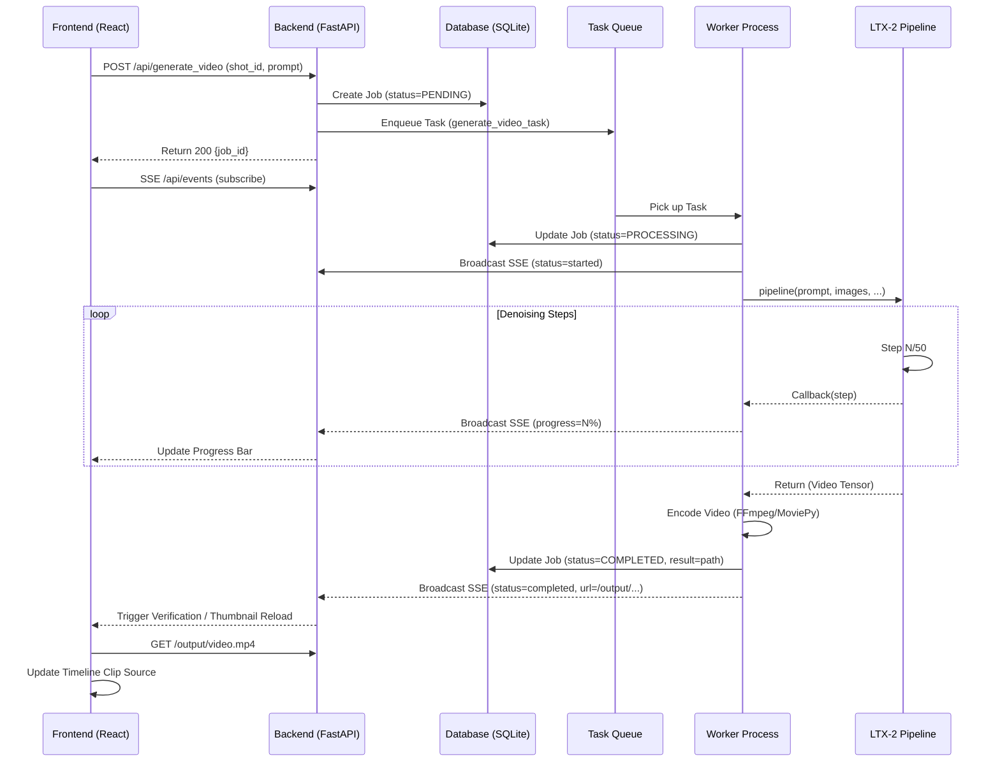
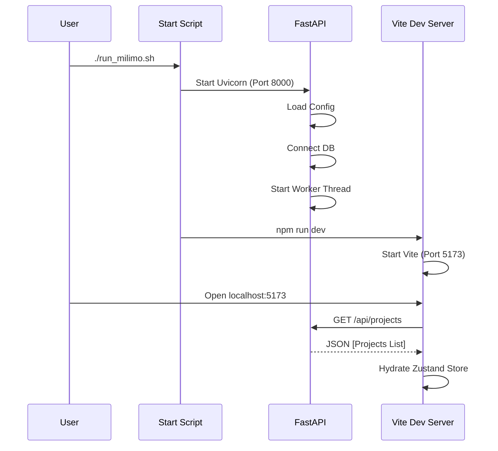

# Milimo Video - Execution Flow

## 1. Video Generation Sequence

This diagram illustrates the lifecycle of a `generate_video` request.

```mermaid
sequenceDiagram
    participant UI as Frontend (React)
    participant API as Backend (FastAPI)
    participant DB as Database (SQLite)
    participant Q as Task Queue
    participant W as Worker Process
    participant LTX as LTX-2 Pipeline

    UI->>API: POST /api/generate_video (shot_id, prompt)
    API->>DB: Create Job (status=PENDING)
    API->>Q: Enqueue Task (generate_video_task)
    API-->>UI: Return 200 {job_id}
    
    UI->>API: SSE /api/events (subscribe)
    
    Q->>W: Pick up Task
    W->>DB: Update Job (status=PROCESSING)
    W->>API: Broadcast SSE (status=started)
    
    W->>LTX: pipeline(prompt, images, ...)
    
    loop Denoising Steps
        LTX->>LTX: Step N/50
        LTX-->>W: Callback(step)
        W-->>API: Broadcast SSE (progress=N%)
        API-->>UI: Update Progress Bar
    end
    
    LTX-->>W: Return (Video Tensor)
    W->>W: Encode Video (FFmpeg/MoviePy)
    
    W->>DB: Update Job (status=COMPLETED, result=path)
    W-->>API: Broadcast SSE (status=completed, url=/output/...)
    API-->>UI: Trigger Verification / Thumbnail Reload
    
    UI->>API: GET /output/video.mp4
    UI->>UI: Update Timeline Clip Source
```

## 2. Startup Sequence

```mermaid
sequenceDiagram
    participant User
    participant Script as Start Script
    participant API as FastAPI
    participant React as Vite Dev Server

    User->>Script: ./run_milimo.sh
    Script->>API: Start Uvicorn (Port 8000)
    API->>API: Load Config
    API->>API: Connect DB
    API->>API: Start Worker Thread
    
    Script->>React: npm run dev
    React->>React: Start Vite (Port 5173)
    
    User->>React: Open localhost:5173
    React->>API: GET /api/projects
    API-->>React: JSON [Projects List]
    React->>React: Hydrate Zustand Store
```
