# Milimo Video — Execution Flow

## 1. Video Generation Sequence

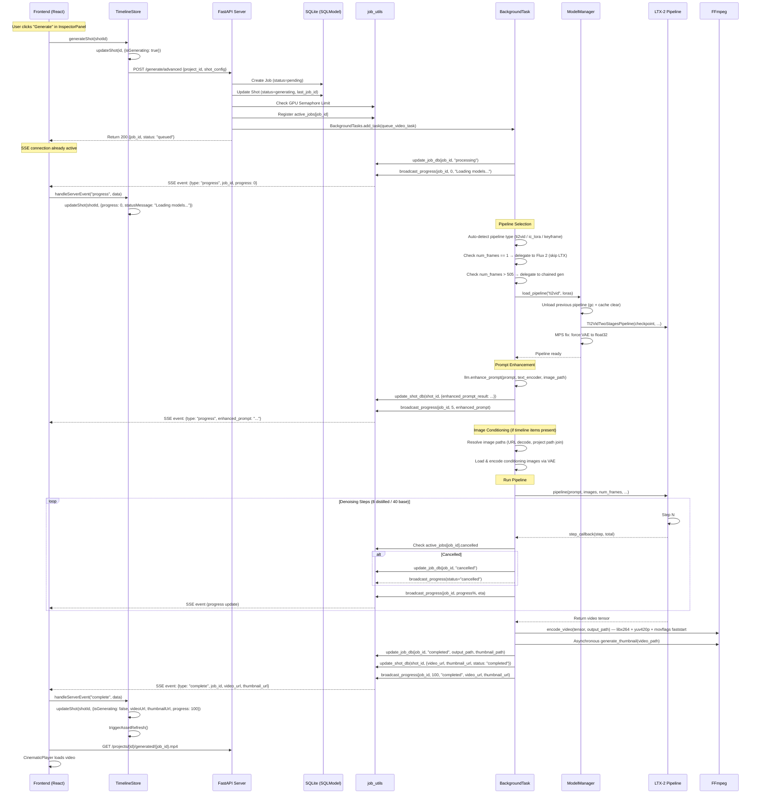

## 2. Image Generation Sequence

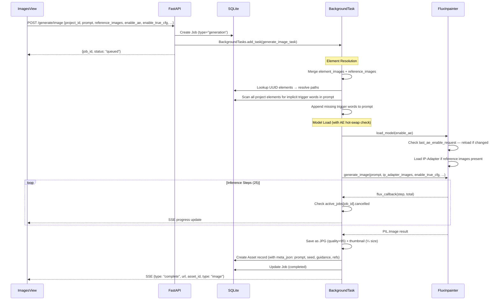

## 3. Inpainting Sequence

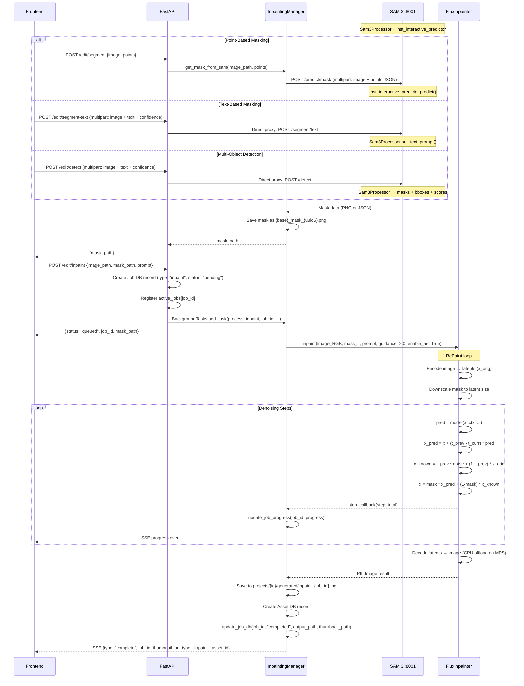

## 4. Chained Generation Sequence

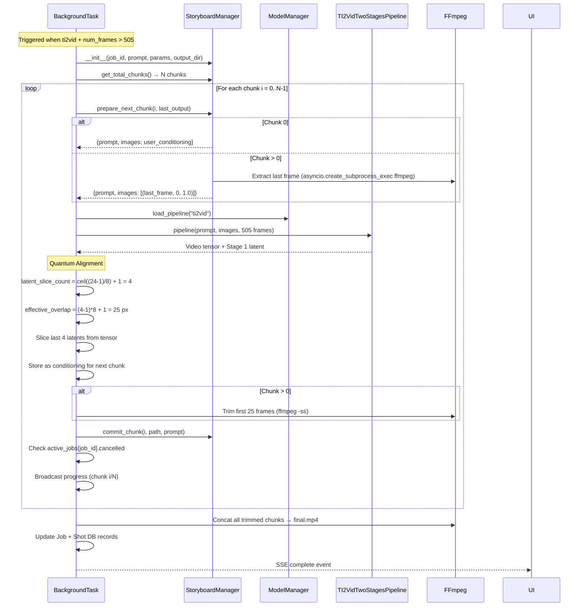

## 5. Startup Sequence

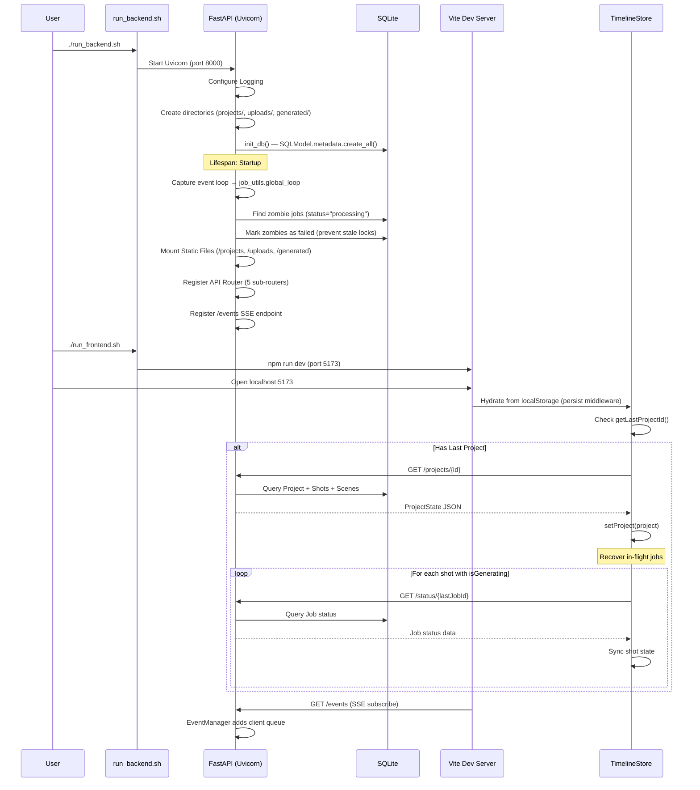

## 6. Storyboard Flow

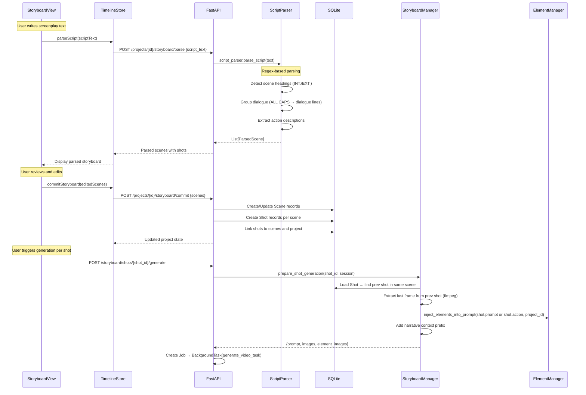

### 6.1 AI Script Analysis Flow

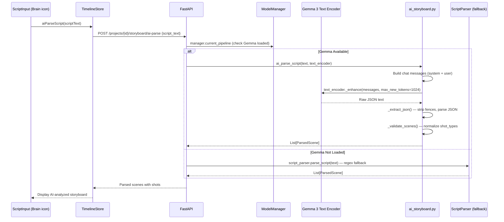

### 6.2 Concept Art Thumbnail Flow

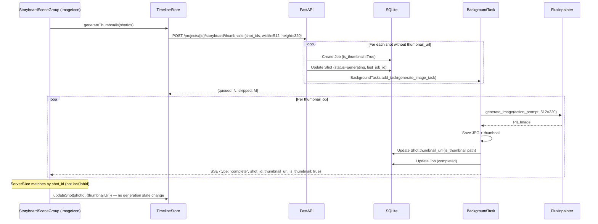

## 7. Project Save/Load Flow

```mermaid
flowchart TD
    subgraph "Save Flow"
        S1[User action triggers auto-save] --> S2[saveProject in ProjectSlice]
        S2 --> S3[PUT /projects/id/save]
        S3 --> S4[Upsert Project in DB]
        S3 --> S5[Sync Shots — Create/Update/Delete]
        S3 --> S6[Sync Scenes — Create/Update/Delete]
        S5 --> S7[Return updated ProjectState]
    end

    subgraph "Load Flow"
        L1[loadProject in ProjectSlice] --> L2[GET /projects/id]
        L2 --> L3[Query Project + Shots + Scenes from DB]
        L3 --> L4[Map camelCase for frontend]
        L4 --> L5[setProject in store]
        L5 --> L6[fetchElements for project]
        L5 --> L7[Save project_id to localStorage]
    end

    subgraph "Auto-Save Hook"
        AS1[useAutoSave in VisualTimeline] --> AS2{Project changed?}
        AS2 -->|Yes| AS3[Debounce 2 seconds]
        AS3 --> AS4[Call saveProject]
        AS2 -->|No| AS5[Skip]
    end
```

## 8. Cancellation Flow

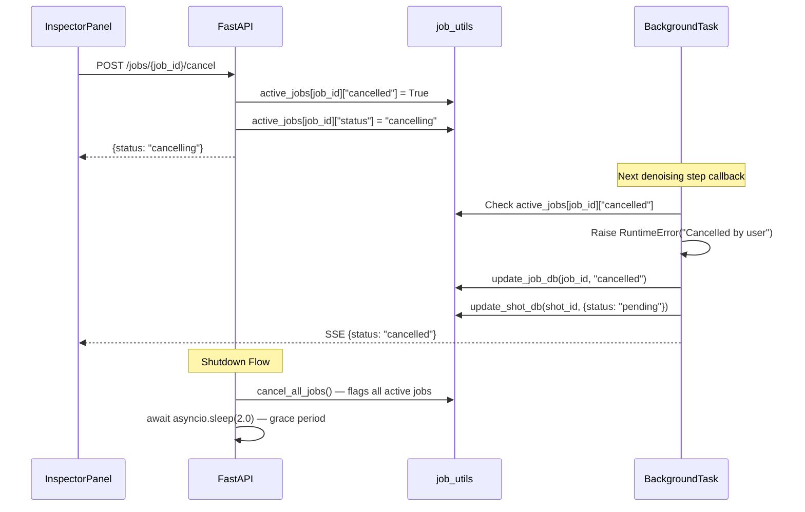

## 9. Playback Engine Loop

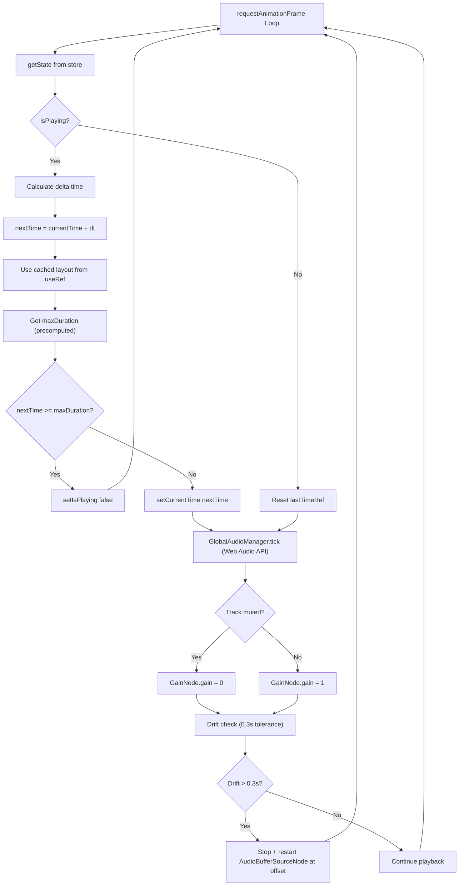

> **Note:** `computeTimelineLayout` is cached in a `useRef` and only recomputed when `project.shots` changes, not every animation frame. Audio uses `AudioContext` + `AudioBufferSourceNode` (Web Audio API) instead of `HTMLAudioElement` for reliable Safari playback.
