# Milimo Video — File Dependency Graph

## 1. Backend Dependency Graph

```mermaid
graph TD
    subgraph "Entry Point"
        server[server.py]
    end

    subgraph "Configuration"
        config[config.py]
    end

    subgraph "Core Infrastructure"
        database[database.py]
        events[events.py]
        schemas[schemas.py]
        job_utils[job_utils.py]
        file_utils[file_utils.py]
    end

    subgraph "API Routes"
        routes_init[routes/__init__.py]
        r_projects[routes/projects.py]
        r_jobs[routes/jobs.py]
        r_assets[routes/assets.py]
        r_elements[routes/elements.py]
        r_storyboard[routes/storyboard.py]
    end

    subgraph "Task Engine"
        worker[worker.py]
        t_video[tasks/video.py]
        t_chained[tasks/chained.py]
        t_image[tasks/image.py]
        model_engine[model_engine.py]
    end

    subgraph "Domain Managers"
        elem_mgr[managers/element_manager.py]
        inp_mgr[managers/inpainting_manager.py]
        flux_wrapper[models/flux_wrapper.py]
        sb_mgr[storyboard/manager.py]
        script_parser[services/script_parser.py]
    end

    %% Server imports
    server --> config
    server --> database
    server --> events
    server --> routes_init
    server --> job_utils

    %% Routes aggregation
    routes_init --> r_projects
    routes_init --> r_jobs
    routes_init --> r_assets
    routes_init --> r_elements
    routes_init --> r_storyboard

    %% Route dependencies
    r_projects --> database
    r_projects --> schemas
    r_projects --> file_utils
    r_projects --> config

    r_jobs --> database
    r_jobs --> schemas
    r_jobs --> job_utils
    r_jobs --> events
    r_jobs --> t_video
    r_jobs --> t_image
    r_jobs --> model_engine

    r_assets --> database
    r_assets --> file_utils
    r_assets --> config

    r_elements --> database
    r_elements --> elem_mgr
    r_elements --> inp_mgr

    r_storyboard --> database
    r_storyboard --> script_parser
    r_storyboard --> sb_mgr
    r_storyboard --> config
    r_storyboard --> t_video
    r_storyboard --> job_utils
    r_storyboard --> events

    %% Task dependencies
    t_video --> config
    t_video --> job_utils
    t_video --> file_utils
    t_video --> events
    t_video --> database
    t_video --> model_engine
    t_video --> flux_wrapper

    t_chained --> config
    t_chained --> job_utils
    t_chained --> file_utils
    t_chained --> sb_mgr
    t_chained --> model_engine

    t_image --> config
    t_image --> job_utils
    t_image --> file_utils
    t_image --> events
    t_image --> database
    t_image --> flux_wrapper

    %% Manager dependencies
    elem_mgr --> database
    elem_mgr --> flux_wrapper
    inp_mgr --> config
    inp_mgr --> flux_wrapper
    inp_mgr --> database

    %% Model Engine
    model_engine --> config

    %% Worker re-exports
    worker --> model_engine
    worker --> t_video
    worker --> t_image

    %% Job utils dependencies
    job_utils --> database
    job_utils --> events
    job_utils --> file_utils

    %% File utils
    file_utils --> config

    %% Storyboard Manager
    sb_mgr --> database
    sb_mgr --> elem_mgr
```

## 2. Frontend Dependency Graph

```mermaid
graph TD
    subgraph "Entry Point"
        main[main.tsx]
        app[App.tsx]
    end

    subgraph "Store Layer"
        store[timelineStore.ts]
        types[types.ts]
        s_project[slices/projectSlice.ts]
        s_shot[slices/shotSlice.ts]
        s_playback[slices/playbackSlice.ts]
        s_ui[slices/uiSlice.ts]
        s_track[slices/trackSlice.ts]
        s_element[slices/elementSlice.ts]
        s_server[slices/serverSlice.ts]
    end

    subgraph "Utilities"
        fe_config[config.ts]
        timelineUtils[timelineUtils.ts]
        globalAudio[GlobalAudioManager.ts]
        jobPoller[jobPoller.ts]
        snapEngine[snapEngine.ts]
    end

    subgraph "Layout & Top-Level"
        layout[Layout.tsx]
        controls[Controls.tsx]
        projmgr[ProjectManager.tsx]
    end

    subgraph "Player Components"
        cinPlayer[CinematicPlayer.tsx]
        playbackEng[PlaybackEngine.tsx]
    end

    subgraph "Timeline Components"
        visTL[VisualTimeline.tsx]
        tlTrack[TimelineTrack.tsx]
        tlClip[TimelineClip.tsx]
        audioClip[AudioClip.tsx]
        playhead[Playhead.tsx]
        timeDisplay[TimeDisplay.tsx]
    end

    subgraph "Inspector Components"
        inspector[InspectorPanel.tsx]
        advSettings[AdvancedSettings.tsx]
        condEditor[ConditioningEditor.tsx]
        narDirector[NarrativeDirector.tsx]
        shotParams[ShotParameters.tsx]
    end

    subgraph "Library & Feature Components"
        mediaLib[MediaLibrary.tsx]
        elemMgr[ElementManager.tsx]
        elemPanel[ElementPanel.tsx]
        imagesView[ImagesView.tsx]
        storyView[StoryboardView.tsx]
    end

    %% Entry
    main --> app
    app --> layout
    app --> cinPlayer

    %% Store composition
    store --> s_project
    store --> s_shot
    store --> s_playback
    store --> s_ui
    store --> s_track
    store --> s_element
    store --> s_server
    store --> types

    %% Slice → API
    s_project --> fe_config
    s_shot --> fe_config
    s_element --> fe_config

    %% Layout
    layout --> visTL
    layout --> inspector
    layout --> mediaLib
    layout --> elemPanel
    layout --> imagesView
    layout --> storyView
    layout --> projmgr
    layout --> store

    %% Player
    cinPlayer --> store
    cinPlayer --> playbackEng
    playbackEng --> store
    playbackEng --> globalAudio
    playbackEng --> timelineUtils

    %% Timeline
    visTL --> tlTrack
    visTL --> playhead
    visTL --> timeDisplay
    visTL --> playbackEng
    visTL --> store
    visTL --> timelineUtils
    visTL --> snapEngine
    tlTrack --> tlClip
    tlTrack --> audioClip
    tlTrack --> store
    tlClip --> store
    audioClip --> store

    %% Inspector
    inspector --> advSettings
    inspector --> condEditor
    inspector --> narDirector
    inspector --> shotParams
    inspector --> store
    inspector --> jobPoller

    %% Library & Features
    mediaLib --> store
    elemMgr --> store
    elemPanel --> store
    imagesView --> store
    storyView --> store

    %% Job Poller
    jobPoller --> store
    jobPoller --> fe_config
```

## 3. Key Module Analysis

### Critical Path Files (Backend)
| File | Inbound Deps | Outbound Deps | Role |
|---|---|---|---|
| `config.py` | 12 files import | 0 | Pure configuration — no external deps |
| `database.py` | 11 files import | `config.py` | ORM + sessions — most depended-on |
| `job_utils.py` | 5 files import | `database`, `events`, `file_utils` | Job lifecycle — central coordination |
| `events.py` | 5 files import | 0 | SSE broadcasting — standalone |
| `file_utils.py` | 5 files import | `config` | Path resolution — utility |
| `model_engine.py` | 3 files import | `config` | GPU model management — LTX-2 pipelines |
| `models/flux_wrapper.py` | 4 files import | 0 (external: torch, flux2, diffusers) | GPU model management — Flux 2 singleton |

### Critical Path Files (Frontend)
| File | Inbound Deps | Outbound Deps | Role |
|---|---|---|---|
| `timelineStore.ts` | 20+ components | 7 slices | God Store — all state lives here |
| `config.ts` | 5+ files | 0 | API_BASE_URL + getAssetUrl |
| `timelineUtils.ts` | 3 files | 0 | computeTimelineLayout — centralized |
| `types.ts` | 8+ files | 0 | All TypeScript interfaces |

### Dependency Metrics
| Metric | Backend | Frontend |
|---|---|---|
| Total Source Files | 24 | 30+ |
| Max Fan-In (most imported) | `config.py` (12) | `timelineStore.ts` (20+) |
| Max Fan-Out (most imports) | `tasks/video.py` (8) | `Layout.tsx` (9+) |
| Circular Dependencies | None | None |
| Singleton Instances | `ModelManager`, `FluxInpainter`, `ElementManager`, `InpaintingManager`, `ScriptParser`, `EventManager` | `GlobalAudioManager` |

### Backend Singleton Inventory
| Singleton | File | Scope | Description |
|---|---|---|---|
| `manager` | `model_engine.py` | Module-level | LTX-2 pipeline lifecycle. One pipeline at a time. |
| `flux_inpainter` | `models/flux_wrapper.py` | Module-level | Flux 2 Klein 9B model. Persistent in memory. |
| `element_manager` | `managers/element_manager.py` | Module-level | Element CRUD + trigger word injection |
| `inpainting_manager` | `managers/inpainting_manager.py` | Module-level | SAM HTTP client + Flux inpaint delegation |
| `script_parser` | `services/script_parser.py` | Module-level | Screenplay text parser |
| `event_manager` | `events.py` | Module-level | SSE broadcast to all connected clients |

## 4. API Endpoint Map

| Method | Path | Router | Handler |
|---|---|---|---|
| POST | `/projects` | projects | `create_project` |
| GET | `/projects` | projects | `list_projects` |
| GET | `/projects/{id}` | projects | `get_project` |
| DELETE | `/projects/{id}` | projects | `delete_project` |
| PUT | `/projects/{id}/save` | projects | `save_project` |
| POST | `/projects/{id}/split_shot` | projects | `split_shot` |
| POST | `/projects/{id}/render` | projects | `render_project` |
| GET | `/projects/{id}/images` | projects | `get_project_images` |
| POST | `/generate_advanced` | jobs | `generate_advanced` → LTX-2 (or Flux if 1 frame) |
| POST | `/generate_image` | jobs | `generate_image_endpoint` → Flux 2 |
| GET | `/status/{job_id}` | jobs | `get_job_status` |
| GET | `/active_jobs` | jobs | `list_active_jobs` |
| POST | `/jobs/{job_id}/cancel` | jobs | `cancel_job` |
| POST | `/upload/{project_id}` | assets | `upload_file` |
| GET | `/assets/last_frame` | assets | `get_last_frame` |
| GET | `/media/{project_id}` | assets | `list_media` |
| GET | `/generated/{project_id}` | assets | `list_generated_for_project` |
| DELETE | `/generated/{project_id}/{filename}` | assets | `delete_generated` |
| GET | `/elements/{project_id}` | elements | `get_elements` |
| POST | `/elements/{project_id}` | elements | `create_element` |
| DELETE | `/elements/{element_id}` | elements | `delete_element` |
| POST | `/elements/{element_id}/visualize` | elements | `visualize_element` → Flux 2 |
| POST | `/edit/segment` | elements | `segment_image` → SAM 3 |
| POST | `/edit/inpaint` | elements | `inpaint_image` → SAM 3 + Flux 2 |
| POST | `/projects/{id}/storyboard/parse` | storyboard | `parse_script` |
| POST | `/projects/{id}/storyboard/commit` | storyboard | `commit_storyboard` |
| GET | `/projects/{id}/storyboard` | storyboard | `get_storyboard` |
| POST | `/storyboard/shots/{shot_id}/generate` | storyboard | `generate_storyboard_shot` → LTX-2 |
| GET | `/events` | server.py (direct) | `event_subscribe` (SSE) |
